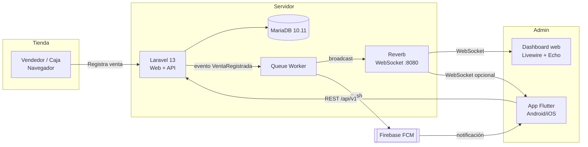
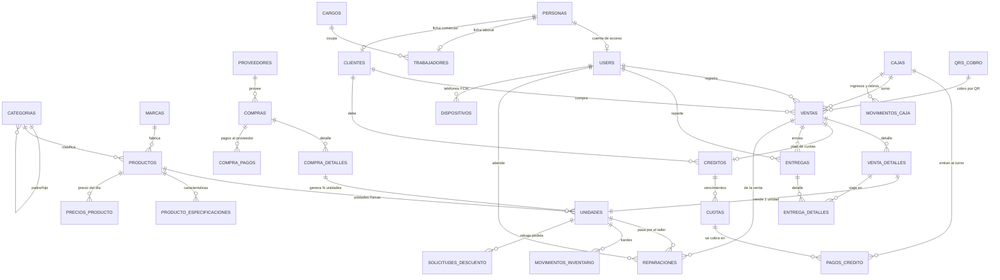

# Arquitectura — Electrónica del Hogar

> Cómo está armado el sistema y por qué: piezas, modelo de datos, cálculo de
> costos y tiempo real. Stack: **Laravel 13 + MariaDB + Velzon (Bootstrap 5) +
> Livewire + Reverb** en el servidor y **Flutter + Riverpod + Dio** en el
> teléfono.
>
> | Para… | Ver |
> |---|---|
> | La lista de endpoints de la app | [API.md](API.md) |
> | Lo hecho, fecha por fecha, y el porqué de cada cambio | [CHANGELOG.md](CHANGELOG.md) |
> | Lo pendiente | [MEJORAS.md](MEJORAS.md) |
> | Levantar el proyecto, tests y convenciones | [DESARROLLO.md](DESARROLLO.md) |
> | Poner y mantener el servidor | [DESPLIEGUE.md](DESPLIEGUE.md) |
> | Usar el sistema día a día | [MANUAL.md](MANUAL.md) |
>
> **El esquema autoritativo son las migraciones** (`database/migrations`). Lo de
> abajo explica las tablas y sus reglas; si una columna no coincide, manda la
> migración y hay que corregir este documento.

## 1. Decisiones de arquitectura

| Tema | Decisión | Motivo |
|---|---|---|
| Tiempo real web | **Laravel Reverb** (WebSockets self-hosted) + Laravel Echo | Oficial de Laravel, gratis, corre junto al proyecto. Dashboard sin recargar. |
| Push móvil | **Firebase Cloud Messaging (FCM)** | Única forma de notificar con la app cerrada. |
| Inventario | **Totalmente serializado** | Cada unidad física = 1 registro `unidades` con serial o código generado. Permite costo real por unidad y trazabilidad compra → venta. |
| App Flutter | **Herramienta de trabajo completa**, no solo consulta | Empezó como «solo administrador» (avisos + reportes). En la tienda resultó que el trabajo ocurre lejos del mostrador —el almacén, el camión, el taller—, así que hoy vende, cobra cuotas, recepciona, reparte y administra el catálogo. Detalle en el README de la app. |
| UI web | **Plantilla Velzon** (Bootstrap 5) + Blade + Vite | Es la plantilla que ya tienes comprada. Bootstrap, no Tailwind. |
| Autenticación | **Laravel Fortify** | Es *headless*: aporta login, throttling, recuperación de contraseña y 2FA sin traer vistas propias, así que las pantallas son las de Velzon sin pelearse con un scaffolding ajeno (Breeze/Jetstream imponen sus vistas en Tailwind). |
| Roles | **spatie/laravel-permission** | Estándar de facto; el menú lateral se filtra solo según permisos. |
| API móvil | Laravel Sanctum (tokens) | Estándar, simple, sin OAuth innecesario. |
| Colas y caché | `database` (también en producción) | Las notificaciones y broadcasts no deben bloquear la venta. El plan original decía `redis` en producción; con el volumen de una tienda la cola en base de datos sobra y es un servicio menos que mantener vivo. Si la cola crece, Redis + Horizon es el paso siguiente (ver [MEJORAS.md](MEJORAS.md)). |
| Tiempo real sin Reverb | **Sondeo como red de seguridad** | Reverb no siempre está corriendo. Cada vista en vivo sondea (10–20 s) además de escuchar el WebSocket, y los avisos se guardan aunque el broadcast falle. |

### Diagrama general



---

## 2. Modelo de datos

### 2.1 Diagrama entidad-relación

> Todo el esquema del negocio está en español; solo las tablas del framework y de spatie (`users`, `roles`, `permissions`…) conservan su nombre original. Ver la nota de nomenclatura en §2.2.



### 2.2 Tablas

**`categorias`** — jerarquía padre/hijo con profundidad ilimitada
```
id, padre_id (FK self, nullable, onDelete restrict), nombre, slug (unique),
descripcion, imagen, posicion (int), activo (bool), timestamps, softDeletes
```
- Usar el paquete `kalnoy/nestedset` (`_lft`, `_rgt`, `depth`) para consultar árboles y descendientes en 1 query.
  > **Desvío aplicado (CRUD 2026-08):** `kalnoy/nestedset` no está instalado y su compatibilidad con Laravel 13 no está garantizada. La tabla quedó con `padre_id` + índice `(padre_id, posicion)` y el árbol se arma en memoria (`groupBy` en el componente Livewire, método `Categoria::descendientesIds()` para impedir ciclos). La migración ya está aplicada y los 80 tests pasan; si se vuelve a nestedset, la migración habría que reescribirla.
- Regla: los productos se asignan **solo a categorías hoja** (validación en el FormRequest).

**`personas`** — datos personales, base del módulo de personal
```
id, user_id (FK users, nullable, UNIQUE, nullOnDelete)  -- 1 a 1 con la cuenta
carnet (unique), nombres, apellido_paterno, apellido_materno (nullable),
celular (nullable), direccion (nullable), correo (unique nullable),
fecha_nacimiento (date nullable), timestamps, softDeletes
```
> `user_id` es nullable porque se registra gente que no usa el panel (un técnico, un chofer). El índice único impide que una cuenta quede ligada a dos personas.

**`cargos`**
```
id, nombre (unique), timestamps
```

**`trabajadores`** — ficha laboral
```
id, persona_id (FK, UNIQUE, cascade), cargo_id (FK, restrictOnDelete),
codigo (unique), fecha_ingreso (date),
fecha_baja (date nullable, indexado), motivo_baja (nullable),
timestamps, softDeletes
```
> `unique(persona_id)` fuerza el 1 a 1 con personas. `restrictOnDelete` en `cargo_id` evita borrar un cargo que todavía tiene trabajadores.
>
> **La baja es un estado, no un borrado.** `fecha_baja` marca a quien ya no trabaja aquí; la fila permanece siempre porque las ventas, compras y movimientos de inventario que se implementen después seguirán apuntando a ella. Los scopes `activos()` y `dadosDeBaja()` alimentan el filtro del listado, y `reactivar()` reincorpora conservando código y fecha de ingreso original. El `softDeletes` sigue ahí pero **no se usa para la baja**: queda para un borrado administrativo real, si alguna vez hace falta.

**`marcas`**
```
id, nombre (unique), slug, logo_ruta, activa, timestamps
```

**`productos`** — el *modelo* del producto, no la unidad física
```
id, categoria_id (FK), marca_id (FK nullable), sku (unique), nombre, slug,
modelo, descripcion, imagen,
precio_venta (decimal 12,2)  -- precio de lista sugerido
descuento_maximo (decimal 12,2, default 0)  -- tope de rebaja en Bs (2026-08-20)
stock_minimo (int, default 0), meses_garantia (int, default 12),
activo (bool), timestamps, softDeletes
```
> **`descuento_maximo` (2026-08-20):** lo máximo que el mostrador puede rebajar de este producto, en Bs y no en porcentaje — la tienda negocia «hasta 50 Bs menos», no «hasta un 8 %». Por defecto **0**, que significa «se cobra el precio de lista»: sin autorización expresa en la ficha, el POS no deja bajar ni un centavo. El formulario lo valida con `lte:precio` (rebajar más que el precio dejaría vender gratis) y `RegistroDeVenta` lo vuelve a comprobar al cobrar.

> **CRUD aplicado (2026-08):** marcas y productos implementados con el mismo patrón Livewire del resto. Los logos/imágenes se suben con `WithFileUploads` al disco público (`storage/app/public/marcas`, `.../productos`) y se sirven vía `storage:link` (ya ejecutado). `marcas` no lleva softDeletes según el plan; `productos` sí. Productos solo cuelgan de categorías (sin restricción de hoja todavía: la validación de categoría hoja llega con compras).

**`producto_especificaciones`** — características del producto, una por fila *(implementada 2026-09-06)*
```
id, producto_id (FK cascade), clave (string 60), valor (string 200, nullable),
posicion (int, el orden en que se registraron), timestamps
ÍNDICES: index(producto_id, posicion)
```
> Modelo `ProductoEspecificacion`. Reemplaza a la columna JSON `productos.especificaciones`, que tenía un fallo serio de formato: convivían **tres** formatos según por dónde se guardara (objeto `{clave: valor}` del panel, lista de pares del teléfono, y un string de más por un `json_encode` en un seeder que el cast `array` volvía a codificar). El resultado era que al editar un producto, la primera columna salía «0» y el valor traía el JSON entero pegado.
>
> La tabla normaliza todo: una fila por característica, en orden. `valor` **null** es la bandera de distintivo sin valor («Bluetooth»), que antes se guardaba como `true`. La migración copió lo que había tolerando los tres formatos (`App\Support\Especificaciones::filasDesdeValor`), y el panel, la API y la app ya leen/escriben filas. El teléfono sigue mandando y recibiendo una **lista de pares** `[{clave, valor}]`; el cambio es interno y no tocó el contrato de la API.

**`proveedores`**
```
id, nombre, nit (NIT/RUC, unique nullable), contacto, telefono, correo,
direccion, notas, activo, timestamps, softDeletes
```
> **CRUD aplicado (fase 3):** permisos `proveedores.*`, ruta `/proveedores`. Un proveedor con compras registradas **no se puede eliminar** (`restrictOnDelete`): dejaría sin origen el costo de las unidades que trajo. Para esos casos está el interruptor de activo/inactivo, que lo saca del selector de compras nuevas sin tocar el histórico.

**`compras`** — cabecera de compra
```
id, proveedor_id (FK), user_id (FK), codigo (unique, ej. COM-2026-0001),
numero_factura, fecha_compra (date),
subtotal, descuento, impuesto, flete, otros_gastos, total (decimal 12,2),
moneda (char 3, default 'BOB'), tipo_cambio (decimal 12,6, default 1),
estado (enum: draft|received|cancelled), notas, timestamps
```

**`compra_detalles`** — detalle de compra
```
id, compra_id (FK cascade), producto_id (FK),
cantidad (int), costo_unitario (decimal 12,2), subtotal (decimal 12,2),
costo_real_unitario (decimal 12,2),  -- costo_unitario + prorrateo de flete/otros gastos
precio_venta (decimal 12,2),        -- precio con el que saldrán estas unidades
timestamps
UNIQUE (compra_id, producto_id)
```
> **CRUD aplicado (fase 3):** cabecera + detalle en una sola pantalla (`/compras`), con panel de detalle desplegable. `unique(compra_id, producto_id)` impide repetir un producto en dos líneas de la misma compra: el prorrateo y el conteo de unidades se volverían ambiguos.
>
> **Estados:** una compra nace en `draft` y se puede editar libremente. Al **recepcionar** pasa a `received` y queda congelada — no se pueden cambiar sus líneas ni sus gastos, porque el costo de unidades que ya están en el almacén (o vendidas) dejaría de coincidir con lo que realmente se pagó. Un borrador sí se puede eliminar; una recepcionada, no.
>
> El código lo genera `App\Support\GeneradorCodigoCompra` con formato `COM-2026-0001`, correlativo por año y con reintento ante colisiones (misma estrategia que los otros generadores).

**`unidades`** ⭐ — **la unidad física. Corazón del sistema.** (El plan original la llamaba `items`, con columnas en inglés; se implementó en español.)
```
id,
producto_id (FK),
compra_detalle_id (nullable), compra_id (nullable, denormalizado),
serial (string, unique nullable)        -- serial del fabricante si existe
codigo_interno (string, unique)         -- SIEMPRE se genera
costo_unitario (decimal 12,2)           -- costo real de ESTA unidad (landed cost)
precio_venta (decimal 12,2)             -- respaldo; la referencia es el precio del día
estado (enum: en_stock|reservado|vendido|devuelto|danado|garantia|perdido)
ubicacion (string 120, ej. "Bodega A / Estante 3"),
garantia_hasta (date nullable),
ingresado_en (datetime), vendido_en (datetime nullable),
notas, timestamps, softDeletes
-- + reservado_por / reservado_hasta (2026-09-12): la reserva de 20 min del carrito

ÍNDICES: unique(serial), unique(codigo_interno), index(producto_id, estado),
         index(compra_id), index(estado, vendido_en)
```

> **Etiquetas implementadas (fase 3).** `milon/barcode` genera el código de barras en **Code128**, que es obligatorio aquí: el formato `{SKU}-{AAMM}-{correlativo}` lleva letras y guiones, y EAN o UPC solo aceptan dígitos.
>
> `App\Support\GeneradorEtiquetas` devuelve el SVG ya recortado (la librería lo entrega con prólogo XML y DOCTYPE, que no se pueden incrustar en medio de un HTML). `EtiquetaController` arma la hoja imprimible, con layout propio sin menú.
>
> - Desde una compra recepcionada: `/etiquetas/compra/{id}` imprime el lote completo de una vez.
> - Desde el inventario: botón por fila, o selección múltiple con checkbox y "Imprimir etiquetas".
> - Tres tamaños (50×25, 70×35 y 100×50 mm) y hasta 5 copias por unidad.
>
> Las medidas van en **milímetros**, no en píxeles: una etiqueta tiene que salir del tamaño real del adhesivo y el píxel depende del DPI. Verificado en el navegador: 70×35 mm renderiza exactamente 265×132 px. Al imprimir se ocultan los controles y el borde punteado de guía (ensuciaría el adhesivo precortado), y `break-inside: avoid` impide que una etiqueta se parta entre dos páginas.

> **Generación de `internal_code`:** siempre se emite, tenga o no serial de fábrica, para poder imprimir una etiqueta con código de barras (Code128) o QR uniforme.
> Formato: `{SKU_PRODUCTO}-{AAMM}-{correlativo 4 dígitos}` → `TVSAM55-2608-0042`.
> Se genera en un `Observer`/servicio `ItemCodeGenerator` dentro de una transacción con `lockForUpdate()` sobre un contador, para evitar duplicados con concurrencia.
>
> **CRUD aplicado (2026-08):** inventario de unidades implementado (`App\Livewire\Items\Index`, ruta `/inventario/items`, permisos `items.*`). `App\Support\GeneradorCodigoItem` genera el `internal_code` por producto y mes (`{SKU}-{AAMM}-{####}`) con reintento ante colisiones; el listado se enlaza desde productos por sesión (sin exponer ids en la URL). Los campos `purchase_item_id`/`purchase_id` quedaron como columnas sin FK (la tabla compras no existe aún). Las unidades vendidas no se pueden eliminar.

---

> ### 🇪🇸 Nomenclatura de aquí en adelante
>
> **Toda la base de datos está en español.** En agosto de 2026 se tradujeron también las tablas que habían nacido en inglés, así que ya no hay mezcla:
>
> | Antes | Ahora | Modelo |
> |---|---|---|
> | `categories` | `categorias` | `Categoria` |
> | `brands` | `marcas` | `Marca` |
> | `products` | `productos` | `Producto` |
> | `items` | `unidades` | `Unidad` |
> | `suppliers` | `proveedores` | `Proveedor` |
> | `purchases` | `compras` | `Compra` |
> | `purchase_items` | `compra_detalles` | `CompraDetalle` |
>
> Las columnas y los valores de los `enum` también (`in_stock` → `en_stock`, `draft` → `borrador`). **Se quedan en inglés** `users`, `roles`, `permissions`, `notifications`, `jobs` y demás tablas del framework y de spatie: las crea y gestiona código de terceros.
>
> Como no había datos de producción, no se escribieron migraciones `rename`: se editaron las migraciones originales y se regeneró la base con `migrate:fresh --seed`. Si algún día hay datos reales, este atajo ya no sirve.
>
> Convenciones para lo nuevo:
> - Tabla en **plural**, columnas en **singular** y **sin tildes ni ñ** (`direccion`, no `dirección`; `anio`, no `año`): evita problemas de collation y de escapado en las consultas.
> - Claves foráneas: `{tabla_singular}_id` (`cliente_id`, `venta_id`). Las que apuntan a tablas ya existentes conservan su nombre en inglés (`item_id`, `product_id`, `user_id`).
> - Los `enum` también en español (`estado: completada|anulada`), porque se muestran al usuario.
> - Cuando el nombre en español no coincida con la pluralización de Laravel, se declara `protected $table` explícitamente en el modelo.

**`clientes`** — ficha comercial *(implementada 2026-08-16)*
```
id, persona_id (FK, UNIQUE, cascade), codigo (unique),
timestamps, softDeletes
```
> Modelo `Cliente`. **Cambió respecto al plan original**, que le daba a la tabla sus propios `nombre`, `documento`, `celular` y `correo`. Ahora sigue la misma forma que `trabajadores`: los datos personales viven en `personas` y aquí solo va lo que hace a alguien cliente. Así una persona puede ser trabajador y cliente a la vez sin que sus datos se dupliquen ni se contradigan, y corregir un celular se hace en un solo sitio.
>
> `unique(persona_id)` fuerza el 1 a 1. La venta al público sin datos sigue siendo lo habitual en tienda, por eso `cliente_id` es nullable en `ventas`.

**`ventas`** — cabecera de venta
```
id, cliente_id (FK nullable), user_id (FK vendedor),
codigo (unique, ej. VTA-2026-000123), vendida_en (datetime),
subtotal, descuento, impuesto, total (decimal 12,2),
costo_total (decimal 12,2),  -- suma de items.unit_cost
ganancia (decimal 12,2),     -- total - costo_total
metodo_pago (enum: efectivo|tarjeta|transferencia|qr|mixto),
qr_cobro_id (FK qrs_cobro nullable, restrictOnDelete),   -- 2026-08-20
monto_efectivo, monto_qr (decimal 12,2, default 0),      -- 2026-08-20
comprobante_qr (string nullable),                        -- respaldo del banco
estado (enum: completada|anulada),
anulada_en (datetime nullable), motivo_anulacion (nullable),
notas, timestamps

ÍNDICES: index(vendida_en), index(estado, vendida_en), index(user_id)
```
> Modelo `Venta`. `user_id` conserva el nombre en inglés porque apunta a la tabla `users` de Laravel.
>
> **Las ventas nunca se borran, se anulan** (`estado = anulada` + fecha y motivo), igual que la baja de trabajadores: el histórico y los reportes tienen que seguir cuadrando.
>
> **Reparto del cobro (2026-08-20).** Con el pago mixto, `metodo_pago` dejó de bastar: no dice cuánto entró por caja y cuánto por el banco, y sin ese dato el arqueo del día no cuadra contra el extracto. `monto_efectivo` y `monto_qr` se llenan **siempre**, también en los métodos puros, para que cualquier reporte sume una sola columna sin condicionales. La migración repartió el total de las ventas ya registradas según su método.
>
> `credito` nunca llegó a existir en el enum (la venta a crédito no se implementó); en su lugar entró `mixto`.

**`qrs_cobro`** — QR bancarios que la tienda muestra al cobrar *(implementada 2026-08-20)*
```
id, nombre, banco (nullable), titular (nullable), imagen,
fecha_limite (date), activo (bool), notas (nullable),
timestamps, softDeletes

ÍNDICES: index(activo, fecha_limite)
```
> Modelo `QrCobro` (con `$table = 'qrs_cobro'`).
>
> **La fecha límite no es informativa: es la condición para que el POS lo ofrezca.** Los QR que emite el banco caducan, y pasada la fecha el pago no llega. `scopeVigentes()` (activo + `fecha_limite >= hoy`) es lo único que ve el punto de venta, así que un QR caduca solo, sin que nadie tenga que acordarse de desactivarlo. El día de la fecha límite todavía cuenta: el banco lo acepta hasta el cierre.
>
> **Se archivan, no se borran** (softDeletes) y su imagen se conserva en disco: las ventas cobradas con ese QR lo referencian, y la imagen es parte del respaldo de ese cobro.

**`venta_detalles`** — 1 fila = 1 unidad física vendida *(implementada 2026-08-16)*
```
id, venta_id (FK cascade), unidad_id (FK, indexado),
unidad_vendida_id (nullable, UNIQUE),  -- guardia de la doble venta
producto_id (FK), precio_unitario, costo_unitario, descuento,
ganancia (decimal 12,2), timestamps
```
> Modelo `VentaDetalle` (con `$table = 'venta_detalles'`).
>
> **`unidad_vendida_id` sustituye al `unique(item_id)` del plan original**, que tenía un fallo: con el índice único sobre `unidad_id` a secas, un aparato devuelto tras anular una venta volvía al stock pero **no se podía volver a vender nunca**, porque su línea seguía ocupando el índice. Se comprobó contra la base antes de corregirlo.
>
> La solución es una columna aparte que copia `unidad_id` mientras la venta está viva y pasa a `NULL` al anularla. En MySQL los `NULL` no chocan entre sí, así que el índice único sigue impidiendo que un aparato esté en dos ventas **completadas** a la vez, pero deja revenderlo si la anterior se anuló. Las líneas nunca se borran: el histórico conserva ambas ventas.
>
> Sigue siendo una garantía **a nivel de base de datos**, que es lo que importa: no basta con comprobarlo en PHP, porque dos cajeros escaneando el mismo aparato a la vez pasarían la comprobación y solo el índice único frena la segunda venta.
>
> `costo_unitario` se copia de `unidades.costo_unitario` en el momento de la venta: si mañana cambia el costo del producto, la ganancia histórica no debe moverse.

**`reparaciones`** — orden de servicio técnico *(implementada 2026-08-30)*
```
id, codigo (unique, REP-2026-000123), unidad_id (FK),
venta_id (FK nullable), cliente_id (FK nullable),
en_garantia (bool), garantia_hasta (date nullable),
falla_reportada, diagnostico (nullable), trabajo_realizado (nullable),
estado (recibida|en_reparacion|esperando_repuesto|lista|entregada|irreparable|cancelada),
costo (decimal 12,2), tecnico_id (FK users nullable), prometida_para (date nullable),
recibida_en, lista_en (nullable), entregada_en (nullable), entregada_a (nullable),
estado_unidad_origen, recibida_por (FK users), notas, timestamps

ÍNDICES: index(estado, prometida_para), index(unidad_id, recibida_en)
```
> Modelo `Reparacion`. **Ninguna columna nueva en `unidades`**: el estado `garantia` del enum original ya estaba reservado para esto, y la etiqueta pasó de «En garantía» a «En taller» porque por ahí pasan también las reparaciones que el cliente paga.
>
> **`en_garantia` y `garantia_hasta` se congelan al recibir.** Deducirlos al leer los ataría a `productos.meses_garantia`, que alguien puede cambiar mañana: una orden aceptada como garantía aparecería después como cobrable. Mismo criterio que el costo congelado de la venta.
>
> **`estado_unidad_origen`** es de dónde volver al salir del taller. Un aparato vendido vuelve a `vendido`; uno de stock que llegó fallado del proveedor, a `en_stock`. Adivinarlo mal devuelve al catálogo un aparato que ya tiene dueño.
>
> `venta_id` y `cliente_id` son nullables: por el taller pasan también unidades que nunca se vendieron.
>
> **Con código propio**, al revés que las entregas: el cliente se va sin su aparato y con un papel en la mano, y ese papel necesita un número con el que volver.

**`entregas`** — orden de entrega a domicilio *(implementada 2026-08-29)*
```
id, venta_id (FK), cliente_id (FK nullable), direccion, referencia (nullable),
telefono_contacto (nullable), programada_para (date nullable),
estado (pendiente|en_ruta|entregada|fallida|cancelada),
con_instalacion (bool), repartidor_id (FK users nullable),
salio_en, entregada_en, instalada_en (nullables),
recibida_por (nullable), motivo_fallo (nullable),
creado_por (FK users), notas, timestamps

ÍNDICES: index(estado, programada_para), index(repartidor_id)
```
> Modelo `Entrega`. **Sin código propio**: en el mostrador una entrega se nombra por su venta, y un correlativo más sería un número que nadie usa.
>
> Una venta puede tener varias —tres aparatos que no caben en un viaje— y hay ventas que no tienen ninguna, porque el cliente se llevó la licuadora en la mano. `cliente_id` es nullable porque la venta al público también puede necesitar que alguien lleve el aparato a algún sitio.
>
> `telefono_contacto` se copia y no se lee del cliente: quien recibe puede ser otro —la hija, el portero— y su número no tiene por qué acabar en la ficha del cliente.
>
> **No hay estado `por_entregar` en `unidades`**: un aparato vendido y aún en el almacén sigue estando `vendido`. Inventarlo obligaría a que todas las consultas de stock lo conocieran, y la pregunta que contestaría —dónde está físicamente— la responde esta tabla.

**`entrega_detalles`** — qué aparatos van en una entrega *(implementada 2026-08-29)*
```
id, entrega_id (FK cascade), venta_detalle_id (FK),
venta_detalle_activo_id (nullable, UNIQUE),  -- guardia del doble reparto
timestamps

ÍNDICES: unique(entrega_id, venta_detalle_id)
```
> Modelo `EntregaDetalle`. Guarda la **línea de venta**, no la unidad: así se sabe de qué venta salió el aparato sin una consulta más, y una unidad devuelta y revendida no confunde las dos entregas.
>
> `venta_detalle_activo_id` está calcado de `venta_detalles.unidad_vendida_id` y por la misma razón: copia mientras la entrega vive, `NULL` al cancelarla o al devolver el aparato. El índice único impide que un aparato esté en dos entregas **vivas** a la vez, pero deja volver a programarlo si la anterior se canceló.

**`creditos`** — el plan de cuotas de una venta a plazos *(implementada 2026-08-29)*
```
id, venta_id (FK, UNIQUE), cliente_id (FK), cuota_inicial, total_financiado,
numero_cuotas (tinyint), primer_vencimiento (date),
estado (vigente|pagado|anulado), creado_por (FK users), notas, timestamps

ÍNDICES: index(estado, cliente_id)
```
> Modelo `Credito`. **No guarda saldo**: es la suma de lo que falta en las cuotas. Una columna de saldo se desincroniza el día que alguien corrige un pago a mano, y a partir de ahí la cartera miente sin que nadie lo note. En los listados se arma con `withSum` en la misma consulta, para poder ordenar por él sin traer la cartera entera a PHP.
>
> `cliente_id` se repite aquí aunque la venta ya lo sepa: la cartera se consulta por cliente y ese es el camino corto, y además fija quién firmó.
>
> `total_financiado` se guarda aunque parezca deducible de `ventas.total`, porque ese total **cambia** si después se devuelve un aparato.
>
> La **cuota inicial no es una cuota**: es parte del cobro de la venta y vive en `ventas.monto_efectivo`. Se copia aquí para poder leerla sin depender de un total que puede moverse.

**`cuotas`** — cada vencimiento del plan *(implementada 2026-08-29)*
```
id, credito_id (FK cascade), numero (tinyint), vence_en (date),
monto, monto_pagado (default 0), pagada_en (nullable), timestamps

ÍNDICES: unique(credito_id, numero), index(vence_en, pagada_en)
```
> Modelo `Cuota`. **El estado no se guarda**, se deduce de `monto_pagado` contra `monto`; el filtro «pendientes» es un `whereColumn` en SQL. Guardarlo obligaría a recordar actualizarlo en los cuatro caminos que tocan el dinero —cobro, corrección, devolución, anulación— y basta olvidarse en uno para que la cartera empiece a mentir.
>
> Los importes no son todos iguales: `ProrrateoDeGastos::repartir()` carga en las primeras cuotas los centavos que no dividen exactos, así que la suma da el financiado al céntimo.

**`pagos_credito`** — cada imputación de dinero a una cuota *(implementada 2026-08-29)*
```
id, credito_id (FK), cuota_id (FK), recibo (indexado),
caja_id (FK nullOnDelete, nullable), user_id (FK), monto,
metodo_pago (enum: efectivo|qr|transferencia), comprobante_qr (nullable),
pagado_en, notas, timestamps

ÍNDICES: index(caja_id, metodo_pago), index(pagado_en)
```
> Modelo `PagoCredito` (con `$table = 'pagos_credito'`).
>
> `cuota_id` es obligatorio: un pago siempre se imputa a una cuota concreta. Una entrega que alcanza para cuota y media son **dos filas con el mismo `recibo`** — una sola fila con el total dejaría sin respuesta qué cuota quedó saldada, que es lo que se discute en el mostrador.
>
> El número de recibo sale del **id de la primera fila** del grupo: el autoincremento ya garantiza que no se repita, mientras que un `MAX+1` podría dar el mismo número a dos cajeros cobrando a créditos distintos en el mismo instante.
>
> `caja_id` nullable por la misma razón que en `ventas`: se puede cobrar sin caja abierta, y el cierre lo enseña en vez de sumarlo por su cuenta.

**`movimientos_inventario`** — kardex/auditoría de cada unidad *(implementada 2026-08-16)*
```
id, unidad_id (FK cascade), tipo (enum: entrada|salida|ajuste|devolucion|dano|traspaso),
estado_anterior (nullable), estado_nuevo,
origen_type + origen_id (morph nullable: Compra, Venta…),
user_id (FK nullOnDelete), cantidad (siempre 1), notas, created_at

ÍNDICES: index(unidad_id, created_at), index(tipo)
```
> Modelo `MovimientoInventario` (con `$table = 'movimientos_inventario'`, porque Laravel pluralizaría a `movimiento_inventarios`).
>
> Es una tabla de solo escritura: se agregan filas, nunca se editan ni se borran. Por eso lleva `created_at` y no `updated_at` (`public const UPDATED_AT = null`), y hay un test que lo fija.
>
> **Se añadieron `estado_anterior` y `estado_nuevo`,** que no estaban en el plan original. En un inventario serializado lo que se mueve no es una cantidad —siempre es 1— sino el estado del aparato; sin esas dos columnas el kardex sería ilegible. `cantidad` se conserva igualmente para que los reportes puedan sumar sin casos especiales.
>
> `user_id` es `nullOnDelete` y nullable: si algún día se borra un usuario el movimiento sigue existiendo, y en seeders o comandos de consola no hay autor.

**`dispositivos`** — teléfonos registrados para las notificaciones push (FCM)
```
id, user_id (FK cascade), token (unique), plataforma (enum: android|ios),
nombre_dispositivo, ultimo_uso_en, timestamps
```
> Modelo `Dispositivo`.

**`cajas`** — turno de caja *(implementada 2026-08-29)*
```
id, abierta_por (FK users), cerrada_por (FK users nullable),
abierta_en, cerrada_en (nullable),
monto_inicial, monto_declarado (nullable), monto_esperado (nullable),
diferencia (nullable), estado ('abierta'|'cerrada'), notas, timestamps
```
> Al cerrar se guarda una **foto** (`monto_esperado`, `diferencia`) que no se mueve aunque después se anule una venta del turno. `ventas.caja_id` ata cada venta a su turno. Vender exige un turno abierto (2026-09-20).

**`movimientos_caja`** — ingresos y retiros durante el turno *(implementada 2026-09-12)*
```
id, caja_id (FK), user_id (FK), tipo (enum: ingreso|retiro),
monto (decimal 12,2), motivo, created_at
```
> Entran en el esperado del arqueo: un retiro para pagar un flete explica el cajón en vez de aparecer como faltante.

**`compra_pagos`** — pagos al proveedor *(implementada 2026-09-06)*
```
id, compra_id (FK), user_id (FK), monto (decimal 12,2),
imagen (boucher, nullable), fecha, notas, timestamps
```
> Una compra con pagos ya no se edita: su total empezó a moverse.

**`precios_producto`** — el precio del día *(implementada 2026-09-20)*
```
id, producto_id (FK), user_id (FK), fecha (date, indexada),
precio_venta (decimal 12,2), costo_referencia (decimal 12,2), notas,
timestamps — UNIQUE(producto_id, fecha)
```
> Una fila por producto y jornada. El último registrado es el vigente; sin ninguno, el inicial del producto. `PreciosDelDia::listos()` decide si el POS puede cobrar. El precio nunca queda en el costo o por debajo.

**`solicitudes_descuento`** — autorización para bajar del mínimo *(implementada 2026-09-12)*
```
id, unidad_id (FK), producto_id (FK), user_id (FK, quien pide),
precio_lista, descuento_maximo, costo_unitario, precio_solicitado,  -- foto del momento
estado ('pendiente'|'aprobada'|'rechazada'|'consumida'|'cancelada'), precio_aprobado (nullable),
resuelto_por (FK users nullable), resuelto_en, motivo,
venta_id / venta_detalle_id (nullable: se llenan al consumirla), timestamps
```
> `RegistroDeVenta` no se fía del carrito: al cobrar busca una solicitud **aprobada, sin usar y que cubra el precio**, y la consume. Vender por debajo del costo se rechaza siempre.

Más: `qrs_cobro` (arriba), `cache`, `passkeys`, `users`, `notifications` (tabla estándar de Laravel), `jobs`, `failed_jobs`, `personal_access_tokens` — se dejan con su nombre original porque las crea y las gestiona el framework.

### 2.3 Cálculo de costos y ganancias

**Landed cost (costo real por unidad):** al recepcionar una compra, los gastos de la cabecera (`shipping_cost`, `other_costs`, `tax` no recuperable) se prorratean entre las unidades **proporcionalmente al valor** de cada línea:

```
factor_línea      = subtotal_línea / subtotal_compra
gasto_línea       = (shipping + other_costs) * factor_línea
landed_unit_cost  = unit_cost + (gasto_línea / quantity)
```
Ese `landed_unit_cost` se copia a cada `items.unit_cost`. Así la ganancia nunca sale inflada.

> **Implementado en fase 3 — el reparto no pierde centavos.**
>
> Redondear la porción de cada línea por separado casi nunca suma el importe original: un flete de 100 entre tres líneas iguales da 33.33 × 3 = 99.99, y ese centavo que falta se convertiría en ganancia inflada, porque el costo de las unidades saldría por debajo de lo real.
>
> `App\Support\ProrrateoDeGastos` lo resuelve con el **método del resto mayor**: trabaja en centavos enteros (nunca coma flotante), asigna a cada parte su porción truncada y entrega los centavos sobrantes uno a uno a las partes con mayor resto. La suma del reparto es **siempre** exactamente el importe original. Hay un test que lo comprueba sobre 300 combinaciones aleatorias.
>
> El reparto se aplica en dos niveles: primero los gastos entre las líneas (ponderado por el valor de cada una), luego el gasto de cada línea entre sus unidades. Así `Σ items.unit_cost` coincide al centavo con `subtotal + gastos prorrateables`.
>
> `App\Support\RecepcionDeCompra` orquesta todo dentro de una transacción: o se genera el lote completo de unidades y la compra queda recepcionada, o no se crea nada.
>
> **Detalle:** el impuesto **no** se prorratea (en Bolivia suele ser recuperable); solo `shipping_cost` y `other_costs`.

**Ganancia por venta:** `ventas.ganancia = Σ (venta_detalles.precio_unitario − venta_detalles.costo_unitario)`.

**Ganancia por compra** (lo que pediste: "ver las ganancias correspondientes a esa compra"):

| Métrica | Fórmula |
|---|---|
| Inversión | `purchases.total` |
| Unidades vendidas | `count(items where purchase_id = X and status = 'sold')` |
| Ingreso realizado | `Σ venta_detalles.precio_unitario` de esas unidades |
| **Ganancia realizada** | `Σ (precio_unitario − costo_unitario)` de esas unidades |
| Ganancia potencial | `Σ (items.sale_price − items.unit_cost)` de las que siguen `in_stock` |
| % recuperado | `ingreso_realizado / purchases.total` |
| Margen | `ganancia_realizada / ingreso_realizado` |

> En la implementación las tablas son `compras` y `unidades` (no `purchases`/`items`). El ingreso realizado sale de `venta_detalles.precio_unitario − venta_detalles.descuento` —lo realmente cobrado— (`App\Support\Reportes`) y descarta las ventas anuladas.

Todo se resuelve con un `JOIN unidades ON unidades.compra_id` — por eso vale la pena denormalizar `compra_id` en `unidades`.

---

## 3. Módulos de la aplicación web

1. **Autenticación y roles** — `admin`, `supervisor`, `vendedor` (paquete `spatie/laravel-permission`). Policies por modelo.
2. **Catálogo** — categorías (árbol drag&drop), marcas, productos.
3. **Compras** — proveedores, orden de compra, **recepción**: al marcar `received` se generan automáticamente N `items` por línea; pantalla para capturar seriales uno a uno (o dejar en blanco → código autogenerado). Impresión de etiquetas con código de barras.
4. **Inventario** — buscador de items por serial/código, estados, kardex, ajustes, transferencias.
5. **Ventas (POS)** — buscar producto → seleccionar unidad disponible (por serial/código escaneado) → cobrar. Transacción atómica: crear `venta` + `venta_detalles`, marcar items como `sold`, registrar el movimiento de inventario y disparar el evento.
6. **Reportes** — ventas por día/semana/mes, por vendedor, por categoría, top productos, rentabilidad por compra y por proveedor, stock bajo mínimo.
7. **Dashboard en vivo** — contadores y últimas ventas actualizándose sin recargar.
8. **Caja** — turno con fondo inicial, ingresos y retiros, arqueo y histórico de cierres. Sin caja abierta no se cobra.
9. **Precios del día** — la jornada empieza fijando precios; sin ellos el POS no cobra.
10. **Autorizaciones** — rebajas por debajo del mínimo que aprueba, ajusta o rechaza quien tiene `ventas.autorizar_descuento`.
11. **Créditos y cuotas** — venta a plazos sin interés, cartera y cobro imputado de la cuota más antigua a la más nueva.
12. **Entregas** — programación, tablero del día, despacho y confirmación con quien recibe.
13. **Servicio técnico** — orden de taller por serial, garantía calculada desde la venta, diagnóstico y entrega.
14. **Escaparate público** — `GET /` y `GET /producto/{slug}` (`App\Http\Controllers\StorefrontController`). Es la cara «de tienda» del catálogo, abierta a quien **no tiene sesión**.

> **La raíz ya no manda al panel.** Antes `GET /` redirigía a `/dashboard`; ahora muestra el catálogo —los más vendidos y las categorías, la misma fuente que la Vitrina (`App\Support\Vitrina`)—, con buscador, filtros por categoría (incluidas subcategorías), marca y disponibilidad, y ficha de producto con precio, características y relacionados. El acceso del personal sigue en `/login`, y Fortify manda a `/dashboard` al entrar, así que para quien trabaja **nada cambia**.
>
> El escaparate **nunca expone costos ni ganancia**: solo `precio_venta` y unidades disponibles. Un producto archivado o de una categoría oculta responde 404 aunque alguien tenga el enlace guardado. Reutiliza `App\Support\Vitrina`, así que «qué es recomendado» se sigue tocando en un solo sitio; lo cubre `tests/Feature/TiendaPublicaTest.php`.

---

## 4. Tiempo real (dashboard sin recargar)

**Flujo:**

```
RegistroDeVenta::crear()  →  DB::transaction()  →  event(new VentaRegistrada($venta))
                                                      ├─ ShouldBroadcast → canal privado `ventas`
                                                      └─ Listener (encolado) → FCM al administrador
Dashboard Livewire  ←  Echo escucha `ventas:VentaRegistrada`  →  refresca los contadores
```

**Backend**
- `App\Events\VentaRegistrada implements ShouldBroadcast`, canal `PrivateChannel('ventas')`, payload liviano (id, código, total, ganancia, vendedor, productos, hora).
- `routes/channels.php`: autorizar el canal `ventas` solo a los roles admin y supervisor.
- El servicio va en `App\Support\RegistroDeVenta`, junto a `RecepcionDeCompra` y los generadores de código, que es donde ya vive la lógica de negocio de este proyecto.
- Componente Livewire `DashboardEnVivo` con:
  ```php
  #[On('echo-private:ventas,VentaRegistrada')]
  public function alRegistrarseUnaVenta(array $payload) { ... }
  ```

**Procesos que deben correr en producción** (Supervisor / NSSM en Windows):
```bash
php artisan reverb:start --host=0.0.0.0 --port=8080
php artisan queue:work --tries=3
php artisan schedule:work
```

---

## 5. Operación y seguridad

- `.env` fuera del control de versiones; `APP_DEBUG=false` en producción.
- Backup diario de la base (`spatie/laravel-backup`) con retención de 30 días.
- `activitylog` de Spatie sobre unidades, ventas y compras (quién tocó qué).
- HTTPS obligatorio; Reverb detrás de proxy con `wss://`. **Pendiente en el
  servidor actual**, que todavía responde por `http://69.62.91.168:8010` (ver
  [MEJORAS.md](MEJORAS.md)).
- Soft deletes en todo lo maestro; las ventas **nunca** se borran, se anulan.
- Los precios y costos siempre `decimal(12,2)` — nunca `float`.

> **Implementado en la fase 9**, salvo `activitylog`: el kardex ya registra
> quién movió cada unidad y por qué, que es la auditoría que este negocio
> necesita. Añadir un segundo registro paralelo sobre las mismas tablas
> duplicaría la escritura y obligaría a decidir cuál de los dos manda.
>
> El detalle operativo está en **[DESPLIEGUE.md](DESPLIEGUE.md)**; el uso
> diario, en **[MANUAL.md](MANUAL.md)**.

---

## 6. Servicios externos

**No falta instalar ningún paquete.** `laravel-notification-channels/fcm` ya está instalado; lo único que falta son las **credenciales de Firebase**. El sistema funciona sin ellas: los avisos se guardan en base de datos y se leen por `GET /api/v1/notificaciones`; lo único que falta es que lleguen al teléfono.

En el `.env`:

```
FIREBASE_CREDENTIALS=/ruta/al/service-account.json
FIREBASE_PROJECT_ID=tu-proyecto
```

`App\Notifications\VentaRegistradaPush::via()` detecta solas las dos cosas y añade el canal `fcm` sin tocar código.

> Ya instalados: `milon/barcode` (fase 3, etiquetas), `laravel/reverb` + `laravel-echo` + `pusher-js` (fase 6, dashboard en vivo), `laravel/sanctum` (fase 7, API), `spatie/laravel-backup` (fase 9, copias), `barryvdh/laravel-dompdf` (2026-08-21, recibo de venta en PDF). `kalnoy/nestedset` se descartó: ver la nota en `categorias`.
