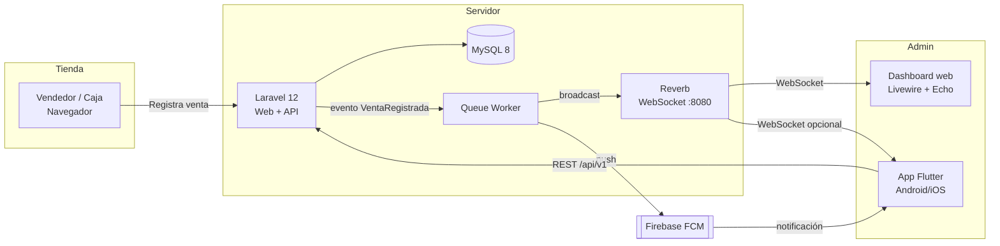
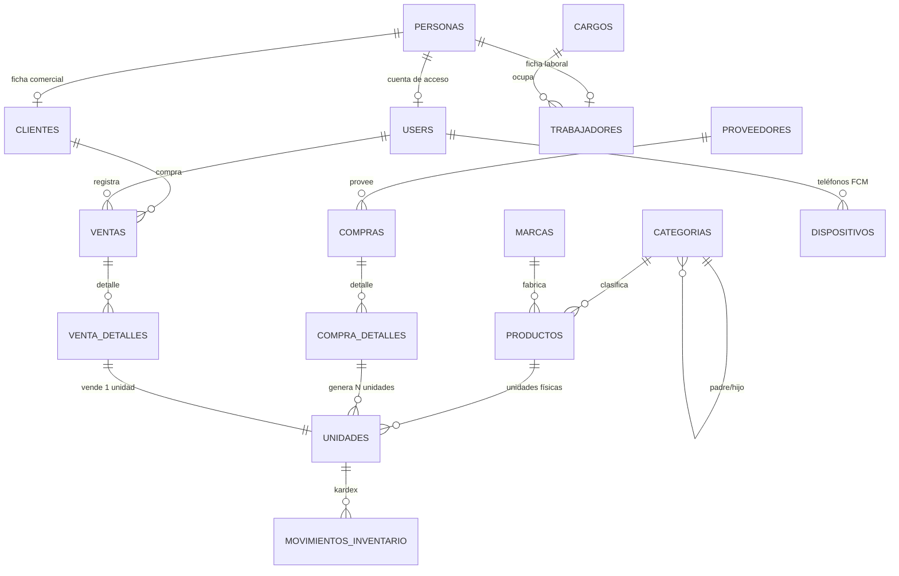

# Plan de desarrollo — Sistema de administración de ventas (Electrónica del Hogar)

> Documento maestro del proyecto. Stack: **Laravel 13 + MariaDB + Velzon (Bootstrap 5) + Reverb** (web/API) y **Flutter 3.x + FCM** (app del administrador).
>
> **Estado:** las nueve fases implementadas (ver §12). Lo único pendiente son
> las credenciales de Firebase, sin las cuales los avisos se guardan y se leen
> por API pero no llegan al teléfono. Guías separadas:
> **[DESPLIEGUE.md](DESPLIEGUE.md)** y **[MANUAL.md](MANUAL.md)**.

---

## 1. Decisiones de arquitectura

| Tema | Decisión | Motivo |
|---|---|---|
| Tiempo real web | **Laravel Reverb** (WebSockets self-hosted) + Laravel Echo | Oficial de Laravel, gratis, corre junto al proyecto. Dashboard sin recargar. |
| Push móvil | **Firebase Cloud Messaging (FCM)** | Única forma de notificar con la app cerrada. |
| Inventario | **Totalmente serializado** | Cada unidad física = 1 registro `unidades` con serial o código generado. Permite costo real por unidad y trazabilidad compra → venta. |
| App Flutter | **Solo administrador** (notificaciones + reportes) | Alcance definido: seguimiento de ventas día/semana/mes. |
| UI web | **Plantilla Velzon** (Bootstrap 5) + Blade + Vite | Es la plantilla que ya tienes comprada. Bootstrap, no Tailwind. |
| Autenticación | **Laravel Fortify** | Es *headless*: aporta login, throttling, recuperación de contraseña y 2FA sin traer vistas propias, así que las pantallas son las de Velzon sin pelearse con un scaffolding ajeno (Breeze/Jetstream imponen sus vistas en Tailwind). |
| Roles | **spatie/laravel-permission** | Estándar de facto; el menú lateral se filtra solo según permisos. |
| API móvil | Laravel Sanctum (tokens) | Estándar, simple, sin OAuth innecesario. |
| Colas | `database` (dev) → `redis` (producción) | Las notificaciones y broadcasts no deben bloquear la venta. |

### Diagrama general



---

## 2. Modelo de datos

### 2.1 Diagrama entidad-relación

> Todo el esquema del negocio está en español; solo las tablas del framework y de spatie (`users`, `roles`, `permissions`…) conservan su nombre original. Ver la nota de nomenclatura en §2.2.



### 2.2 Tablas

**`categorias`** — jerarquía padre/hijo con profundidad ilimitada
```
id, padre_id (FK self, nullable, onDelete restrict), nombre, slug (unique),
descripcion, imagen, posicion (int), activo (bool), timestamps, softDeletes
```
- Usar el paquete `kalnoy/nestedset` (`_lft`, `_rgt`, `depth`) para consultar árboles y descendientes en 1 query.
  > **Desvío aplicado (CRUD 2026-08):** `kalnoy/nestedset` no está instalado y su compatibilidad con Laravel 13 no está garantizada. La tabla quedó con `padre_id` + índice `(padre_id, posicion)` y el árbol se arma en memoria (`groupBy` en el componente Livewire, método `Categoria::descendientesIds()` para impedir ciclos). La migración ya está aplicada y los 80 tests pasan; si se vuelve a nestedset, la migración habría que reescribirla.
- Regla: los productos se asignan **solo a categorías hoja** (validación en el FormRequest).

**`personas`** — datos personales, base del módulo de personal
```
id, user_id (FK users, nullable, UNIQUE, nullOnDelete)  -- 1 a 1 con la cuenta
carnet (unique), nombres, apellido_paterno, apellido_materno (nullable),
celular (nullable), direccion (nullable), correo (unique nullable),
fecha_nacimiento (date nullable), timestamps, softDeletes
```
> `user_id` es nullable porque se registra gente que no usa el panel (un técnico, un chofer). El índice único impide que una cuenta quede ligada a dos personas.

**`cargos`**
```
id, nombre (unique), timestamps
```

**`trabajadores`** — ficha laboral
```
id, persona_id (FK, UNIQUE, cascade), cargo_id (FK, restrictOnDelete),
codigo (unique), fecha_ingreso (date),
fecha_baja (date nullable, indexado), motivo_baja (nullable),
timestamps, softDeletes
```
> `unique(persona_id)` fuerza el 1 a 1 con personas. `restrictOnDelete` en `cargo_id` evita borrar un cargo que todavía tiene trabajadores.
>
> **La baja es un estado, no un borrado.** `fecha_baja` marca a quien ya no trabaja aquí; la fila permanece siempre porque las ventas, compras y movimientos de inventario que se implementen después seguirán apuntando a ella. Los scopes `activos()` y `dadosDeBaja()` alimentan el filtro del listado, y `reactivar()` reincorpora conservando código y fecha de ingreso original. El `softDeletes` sigue ahí pero **no se usa para la baja**: queda para un borrado administrativo real, si alguna vez hace falta.

**`marcas`**
```
id, nombre (unique), slug, logo_ruta, activa, timestamps
```

**`productos`** — el *modelo* del producto, no la unidad física
```
id, categoria_id (FK), marca_id (FK nullable), sku (unique), nombre, slug,
modelo, descripcion, especificaciones (json), imagen,
precio_venta (decimal 12,2)  -- precio de lista sugerido
descuento_maximo (decimal 12,2, default 0)  -- tope de rebaja en Bs (2026-08-20)
stock_minimo (int, default 0), meses_garantia (int, default 12),
activo (bool), timestamps, softDeletes
```
> **`descuento_maximo` (2026-08-20):** lo máximo que el mostrador puede rebajar de este producto, en Bs y no en porcentaje — la tienda negocia «hasta 50 Bs menos», no «hasta un 8 %». Por defecto **0**, que significa «se cobra el precio de lista»: sin autorización expresa en la ficha, el POS no deja bajar ni un centavo. El formulario lo valida con `lte:precio` (rebajar más que el precio dejaría vender gratis) y `RegistroDeVenta` lo vuelve a comprobar al cobrar.

> **CRUD aplicado (2026-08):** marcas y productos implementados con el mismo patrón Livewire del resto. Los logos/imágenes se suben con `WithFileUploads` al disco público (`storage/app/public/marcas`, `.../productos`) y se sirven vía `storage:link` (ya ejecutado). `marcas` no lleva softDeletes según el plan; `productos` sí. `especificaciones` se captura en el formulario como líneas «clave: valor». Productos solo cuelgan de categorías (sin restricción de hoja todavía: la validación de categoría hoja llega con compras).

**`proveedores`**
```
id, nombre, nit (NIT/RUC, unique nullable), contacto, telefono, correo,
direccion, notas, activo, timestamps, softDeletes
```
> **CRUD aplicado (fase 3):** permisos `proveedores.*`, ruta `/proveedores`. Un proveedor con compras registradas **no se puede eliminar** (`restrictOnDelete`): dejaría sin origen el costo de las unidades que trajo. Para esos casos está el interruptor de activo/inactivo, que lo saca del selector de compras nuevas sin tocar el histórico.

**`compras`** — cabecera de compra
```
id, proveedor_id (FK), user_id (FK), codigo (unique, ej. COM-2026-0001),
numero_factura, fecha_compra (date),
subtotal, descuento, impuesto, flete, otros_gastos, total (decimal 12,2),
moneda (char 3, default 'BOB'), tipo_cambio (decimal 12,6, default 1),
estado (enum: draft|received|cancelled), notas, timestamps
```

**`compra_detalles`** — detalle de compra
```
id, compra_id (FK cascade), producto_id (FK),
cantidad (int), costo_unitario (decimal 12,2), subtotal (decimal 12,2),
costo_real_unitario (decimal 12,2),  -- costo_unitario + prorrateo de flete/otros gastos
precio_venta (decimal 12,2),        -- precio con el que saldrán estas unidades
timestamps
UNIQUE (compra_id, producto_id)
```
> **CRUD aplicado (fase 3):** cabecera + detalle en una sola pantalla (`/compras`), con panel de detalle desplegable. `unique(compra_id, producto_id)` impide repetir un producto en dos líneas de la misma compra: el prorrateo y el conteo de unidades se volverían ambiguos.
>
> **Estados:** una compra nace en `draft` y se puede editar libremente. Al **recepcionar** pasa a `received` y queda congelada — no se pueden cambiar sus líneas ni sus gastos, porque el costo de unidades que ya están en el almacén (o vendidas) dejaría de coincidir con lo que realmente se pagó. Un borrador sí se puede eliminar; una recepcionada, no.
>
> El código lo genera `App\Support\GeneradorCodigoCompra` con formato `COM-2026-0001`, correlativo por año y con reintento ante colisiones (misma estrategia que los otros generadores).

**`items`** ⭐ — **la unidad física. Corazón del sistema.**
```
id,
product_id (FK),
purchase_item_id (FK nullable), purchase_id (FK nullable, denormalizado),
serial (string 100, unique nullable)       -- serial del fabricante si existe
internal_code (string 40, unique, NOT NULL) -- SIEMPRE se genera
unit_cost (decimal 12,2)   -- costo real de ESTA unidad (landed cost)
sale_price (decimal 12,2)  -- precio con el que salió a venta
status (enum: in_stock|reserved|sold|returned|damaged|warranty|lost)
location (string, ej. "Bodega A / Estante 3"),
warranty_until (date nullable),
entered_at (datetime), sold_at (datetime nullable),
notes, timestamps, softDeletes

ÍNDICES: unique(serial), unique(internal_code), index(product_id, status),
         index(purchase_id), index(status, sold_at)
```

> **Etiquetas implementadas (fase 3).** `milon/barcode` genera el código de barras en **Code128**, que es obligatorio aquí: el formato `{SKU}-{AAMM}-{correlativo}` lleva letras y guiones, y EAN o UPC solo aceptan dígitos.
>
> `App\Support\GeneradorEtiquetas` devuelve el SVG ya recortado (la librería lo entrega con prólogo XML y DOCTYPE, que no se pueden incrustar en medio de un HTML). `EtiquetaController` arma la hoja imprimible, con layout propio sin menú.
>
> - Desde una compra recepcionada: `/etiquetas/compra/{id}` imprime el lote completo de una vez.
> - Desde el inventario: botón por fila, o selección múltiple con checkbox y "Imprimir etiquetas".
> - Tres tamaños (50×25, 70×35 y 100×50 mm) y hasta 5 copias por unidad.
>
> Las medidas van en **milímetros**, no en píxeles: una etiqueta tiene que salir del tamaño real del adhesivo y el píxel depende del DPI. Verificado en el navegador: 70×35 mm renderiza exactamente 265×132 px. Al imprimir se ocultan los controles y el borde punteado de guía (ensuciaría el adhesivo precortado), y `break-inside: avoid` impide que una etiqueta se parta entre dos páginas.

> **Generación de `internal_code`:** siempre se emite, tenga o no serial de fábrica, para poder imprimir una etiqueta con código de barras (Code128) o QR uniforme.
> Formato: `{SKU_PRODUCTO}-{AAMM}-{correlativo 4 dígitos}` → `TVSAM55-2608-0042`.
> Se genera en un `Observer`/servicio `ItemCodeGenerator` dentro de una transacción con `lockForUpdate()` sobre un contador, para evitar duplicados con concurrencia.
>
> **CRUD aplicado (2026-08):** inventario de unidades implementado (`App\Livewire\Items\Index`, ruta `/inventario/items`, permisos `items.*`). `App\Support\GeneradorCodigoItem` genera el `internal_code` por producto y mes (`{SKU}-{AAMM}-{####}`) con reintento ante colisiones; el listado se enlaza desde productos por sesión (sin exponer ids en la URL). Los campos `purchase_item_id`/`purchase_id` quedaron como columnas sin FK (la tabla compras no existe aún). Las unidades vendidas no se pueden eliminar.

---

> ### 🇪🇸 Nomenclatura de aquí en adelante
>
> **Toda la base de datos está en español.** En agosto de 2026 se tradujeron también las tablas que habían nacido en inglés, así que ya no hay mezcla:
>
> | Antes | Ahora | Modelo |
> |---|---|---|
> | `categories` | `categorias` | `Categoria` |
> | `brands` | `marcas` | `Marca` |
> | `products` | `productos` | `Producto` |
> | `items` | `unidades` | `Unidad` |
> | `suppliers` | `proveedores` | `Proveedor` |
> | `purchases` | `compras` | `Compra` |
> | `purchase_items` | `compra_detalles` | `CompraDetalle` |
>
> Las columnas y los valores de los `enum` también (`in_stock` → `en_stock`, `draft` → `borrador`). **Se quedan en inglés** `users`, `roles`, `permissions`, `notifications`, `jobs` y demás tablas del framework y de spatie: las crea y gestiona código de terceros.
>
> Como no había datos de producción, no se escribieron migraciones `rename`: se editaron las migraciones originales y se regeneró la base con `migrate:fresh --seed`. Si algún día hay datos reales, este atajo ya no sirve.
>
> Convenciones para lo nuevo:
> - Tabla en **plural**, columnas en **singular** y **sin tildes ni ñ** (`direccion`, no `dirección`; `anio`, no `año`): evita problemas de collation y de escapado en las consultas.
> - Claves foráneas: `{tabla_singular}_id` (`cliente_id`, `venta_id`). Las que apuntan a tablas ya existentes conservan su nombre en inglés (`item_id`, `product_id`, `user_id`).
> - Los `enum` también en español (`estado: completada|anulada`), porque se muestran al usuario.
> - Cuando el nombre en español no coincida con la pluralización de Laravel, se declara `protected $table` explícitamente en el modelo.

**`clientes`** — ficha comercial *(implementada 2026-08-16)*
```
id, persona_id (FK, UNIQUE, cascade), codigo (unique),
timestamps, softDeletes
```
> Modelo `Cliente`. **Cambió respecto al plan original**, que le daba a la tabla sus propios `nombre`, `documento`, `celular` y `correo`. Ahora sigue la misma forma que `trabajadores`: los datos personales viven en `personas` y aquí solo va lo que hace a alguien cliente. Así una persona puede ser trabajador y cliente a la vez sin que sus datos se dupliquen ni se contradigan, y corregir un celular se hace en un solo sitio.
>
> `unique(persona_id)` fuerza el 1 a 1. La venta al público sin datos sigue siendo lo habitual en tienda, por eso `cliente_id` es nullable en `ventas`.

**`ventas`** — cabecera de venta
```
id, cliente_id (FK nullable), user_id (FK vendedor),
codigo (unique, ej. VTA-2026-000123), vendida_en (datetime),
subtotal, descuento, impuesto, total (decimal 12,2),
costo_total (decimal 12,2),  -- suma de items.unit_cost
ganancia (decimal 12,2),     -- total - costo_total
metodo_pago (enum: efectivo|tarjeta|transferencia|qr|mixto),
qr_cobro_id (FK qrs_cobro nullable, restrictOnDelete),   -- 2026-08-20
monto_efectivo, monto_qr (decimal 12,2, default 0),      -- 2026-08-20
comprobante_qr (string nullable),                        -- respaldo del banco
estado (enum: completada|anulada),
anulada_en (datetime nullable), motivo_anulacion (nullable),
notas, timestamps

ÍNDICES: index(vendida_en), index(estado, vendida_en), index(user_id)
```
> Modelo `Venta`. `user_id` conserva el nombre en inglés porque apunta a la tabla `users` de Laravel.
>
> **Las ventas nunca se borran, se anulan** (`estado = anulada` + fecha y motivo), igual que la baja de trabajadores: el histórico y los reportes tienen que seguir cuadrando.
>
> **Reparto del cobro (2026-08-20).** Con el pago mixto, `metodo_pago` dejó de bastar: no dice cuánto entró por caja y cuánto por el banco, y sin ese dato el arqueo del día no cuadra contra el extracto. `monto_efectivo` y `monto_qr` se llenan **siempre**, también en los métodos puros, para que cualquier reporte sume una sola columna sin condicionales. La migración repartió el total de las ventas ya registradas según su método.
>
> `credito` nunca llegó a existir en el enum (la venta a crédito no se implementó); en su lugar entró `mixto`.

**`qrs_cobro`** — QR bancarios que la tienda muestra al cobrar *(implementada 2026-08-20)*
```
id, nombre, banco (nullable), titular (nullable), imagen,
fecha_limite (date), activo (bool), notas (nullable),
timestamps, softDeletes

ÍNDICES: index(activo, fecha_limite)
```
> Modelo `QrCobro` (con `$table = 'qrs_cobro'`).
>
> **La fecha límite no es informativa: es la condición para que el POS lo ofrezca.** Los QR que emite el banco caducan, y pasada la fecha el pago no llega. `scopeVigentes()` (activo + `fecha_limite >= hoy`) es lo único que ve el punto de venta, así que un QR caduca solo, sin que nadie tenga que acordarse de desactivarlo. El día de la fecha límite todavía cuenta: el banco lo acepta hasta el cierre.
>
> **Se archivan, no se borran** (softDeletes) y su imagen se conserva en disco: las ventas cobradas con ese QR lo referencian, y la imagen es parte del respaldo de ese cobro.

**`venta_detalles`** — 1 fila = 1 unidad física vendida *(implementada 2026-08-16)*
```
id, venta_id (FK cascade), unidad_id (FK, indexado),
unidad_vendida_id (nullable, UNIQUE),  -- guardia de la doble venta
producto_id (FK), precio_unitario, costo_unitario, descuento,
ganancia (decimal 12,2), timestamps
```
> Modelo `VentaDetalle` (con `$table = 'venta_detalles'`).
>
> **`unidad_vendida_id` sustituye al `unique(item_id)` del plan original**, que tenía un fallo: con el índice único sobre `unidad_id` a secas, un aparato devuelto tras anular una venta volvía al stock pero **no se podía volver a vender nunca**, porque su línea seguía ocupando el índice. Se comprobó contra la base antes de corregirlo.
>
> La solución es una columna aparte que copia `unidad_id` mientras la venta está viva y pasa a `NULL` al anularla. En MySQL los `NULL` no chocan entre sí, así que el índice único sigue impidiendo que un aparato esté en dos ventas **completadas** a la vez, pero deja revenderlo si la anterior se anuló. Las líneas nunca se borran: el histórico conserva ambas ventas.
>
> Sigue siendo una garantía **a nivel de base de datos**, que es lo que importa: no basta con comprobarlo en PHP, porque dos cajeros escaneando el mismo aparato a la vez pasarían la comprobación y solo el índice único frena la segunda venta.
>
> `costo_unitario` se copia de `unidades.costo_unitario` en el momento de la venta: si mañana cambia el costo del producto, la ganancia histórica no debe moverse.

**`movimientos_inventario`** — kardex/auditoría de cada unidad *(implementada 2026-08-16)*
```
id, unidad_id (FK cascade), tipo (enum: entrada|salida|ajuste|devolucion|dano|traspaso),
estado_anterior (nullable), estado_nuevo,
origen_type + origen_id (morph nullable: Compra, Venta…),
user_id (FK nullOnDelete), cantidad (siempre 1), notas, created_at

ÍNDICES: index(unidad_id, created_at), index(tipo)
```
> Modelo `MovimientoInventario` (con `$table = 'movimientos_inventario'`, porque Laravel pluralizaría a `movimiento_inventarios`).
>
> Es una tabla de solo escritura: se agregan filas, nunca se editan ni se borran. Por eso lleva `created_at` y no `updated_at` (`public const UPDATED_AT = null`), y hay un test que lo fija.
>
> **Se añadieron `estado_anterior` y `estado_nuevo`,** que no estaban en el plan original. En un inventario serializado lo que se mueve no es una cantidad —siempre es 1— sino el estado del aparato; sin esas dos columnas el kardex sería ilegible. `cantidad` se conserva igualmente para que los reportes puedan sumar sin casos especiales.
>
> `user_id` es `nullOnDelete` y nullable: si algún día se borra un usuario el movimiento sigue existiendo, y en seeders o comandos de consola no hay autor.

**`dispositivos`** — teléfonos registrados para las notificaciones push (FCM)
```
id, user_id (FK cascade), token (unique), plataforma (enum: android|ios),
nombre_dispositivo, ultimo_uso_en, timestamps
```
> Modelo `Dispositivo`.

**`configuraciones`** — parámetros del sistema (moneda, datos de la tienda, umbrales)
```
id, clave (unique), valor (text), tipo (enum: texto|numero|booleano|json),
descripcion, timestamps
```
> Modelo `Configuracion` (con `$table = 'configuraciones'`).

Más: `users`, `notifications` (tabla estándar de Laravel), `jobs`, `failed_jobs`, `personal_access_tokens` — se dejan con su nombre original porque las crea y las gestiona el framework.

### 2.3 Cálculo de costos y ganancias

**Landed cost (costo real por unidad):** al recepcionar una compra, los gastos de la cabecera (`shipping_cost`, `other_costs`, `tax` no recuperable) se prorratean entre las unidades **proporcionalmente al valor** de cada línea:

```
factor_línea      = subtotal_línea / subtotal_compra
gasto_línea       = (shipping + other_costs) * factor_línea
landed_unit_cost  = unit_cost + (gasto_línea / quantity)
```
Ese `landed_unit_cost` se copia a cada `items.unit_cost`. Así la ganancia nunca sale inflada.

> **Implementado en fase 3 — el reparto no pierde centavos.**
>
> Redondear la porción de cada línea por separado casi nunca suma el importe original: un flete de 100 entre tres líneas iguales da 33.33 × 3 = 99.99, y ese centavo que falta se convertiría en ganancia inflada, porque el costo de las unidades saldría por debajo de lo real.
>
> `App\Support\ProrrateoDeGastos` lo resuelve con el **método del resto mayor**: trabaja en centavos enteros (nunca coma flotante), asigna a cada parte su porción truncada y entrega los centavos sobrantes uno a uno a las partes con mayor resto. La suma del reparto es **siempre** exactamente el importe original. Hay un test que lo comprueba sobre 300 combinaciones aleatorias.
>
> El reparto se aplica en dos niveles: primero los gastos entre las líneas (ponderado por el valor de cada una), luego el gasto de cada línea entre sus unidades. Así `Σ items.unit_cost` coincide al centavo con `subtotal + gastos prorrateables`.
>
> `App\Support\RecepcionDeCompra` orquesta todo dentro de una transacción: o se genera el lote completo de unidades y la compra queda recepcionada, o no se crea nada.
>
> **Detalle:** el impuesto **no** se prorratea (en Bolivia suele ser recuperable); solo `shipping_cost` y `other_costs`.

**Ganancia por venta:** `ventas.ganancia = Σ (venta_detalles.precio_unitario − venta_detalles.costo_unitario)`.

**Ganancia por compra** (lo que pediste: "ver las ganancias correspondientes a esa compra"):

| Métrica | Fórmula |
|---|---|
| Inversión | `purchases.total` |
| Unidades vendidas | `count(items where purchase_id = X and status = 'sold')` |
| Ingreso realizado | `Σ venta_detalles.precio_unitario` de esas unidades |
| **Ganancia realizada** | `Σ (precio_unitario − costo_unitario)` de esas unidades |
| Ganancia potencial | `Σ (items.sale_price − items.unit_cost)` de las que siguen `in_stock` |
| % recuperado | `ingreso_realizado / purchases.total` |
| Margen | `ganancia_realizada / ingreso_realizado` |

> **Ya implementado, con una salvedad:** la pantalla de rentabilidad usa hoy `items.sale_price` para el ingreso realizado, porque `venta_detalles` todavía no existe. Al construir ventas hay que cambiarlo a `venta_detalles.precio_unitario`, que es el precio realmente cobrado (con descuentos). Está anotado también en el código.

Todo se resuelve con un `JOIN items ON items.purchase_id` — por eso vale la pena denormalizar `purchase_id` en `items`.

---

## 3. Módulos de la aplicación web

1. **Autenticación y roles** — `admin`, `supervisor`, `vendedor` (paquete `spatie/laravel-permission`). Policies por modelo.
2. **Catálogo** — categorías (árbol drag&drop), marcas, productos.
3. **Compras** — proveedores, orden de compra, **recepción**: al marcar `received` se generan automáticamente N `items` por línea; pantalla para capturar seriales uno a uno (o dejar en blanco → código autogenerado). Impresión de etiquetas con código de barras.
4. **Inventario** — buscador de items por serial/código, estados, kardex, ajustes, transferencias.
5. **Ventas (POS)** — buscar producto → seleccionar unidad disponible (por serial/código escaneado) → cobrar. Transacción atómica: crear `venta` + `venta_detalles`, marcar items como `sold`, registrar el movimiento de inventario y disparar el evento.
6. **Reportes** — ventas por día/semana/mes, por vendedor, por categoría, top productos, rentabilidad por compra y por proveedor, stock bajo mínimo.
7. **Dashboard en vivo** — contadores y últimas ventas actualizándose sin recargar.

---

## 4. Tiempo real (dashboard sin recargar)

**Flujo:**

```
RegistroDeVenta::crear()  →  DB::transaction()  →  event(new VentaRegistrada($venta))
                                                      ├─ ShouldBroadcast → canal privado `ventas`
                                                      └─ Listener (encolado) → FCM al administrador
Dashboard Livewire  ←  Echo escucha `ventas:VentaRegistrada`  →  refresca los contadores
```

**Backend**
- `App\Events\VentaRegistrada implements ShouldBroadcast`, canal `PrivateChannel('ventas')`, payload liviano (id, código, total, ganancia, vendedor, productos, hora).
- `routes/channels.php`: autorizar el canal `ventas` solo a los roles admin y supervisor.
- El servicio va en `App\Support\RegistroDeVenta`, junto a `RecepcionDeCompra` y los generadores de código, que es donde ya vive la lógica de negocio de este proyecto.
- Componente Livewire `DashboardEnVivo` con:
  ```php
  #[On('echo-private:ventas,VentaRegistrada')]
  public function alRegistrarseUnaVenta(array $payload) { ... }
  ```

**Procesos que deben correr en producción** (Supervisor / NSSM en Windows):
```bash
php artisan reverb:start --host=0.0.0.0 --port=8080
php artisan queue:work --tries=3
php artisan schedule:work
```

---

## 5. API para la app Flutter

Base: `/api/v1`, auth `Sanctum` (Bearer token), respuestas con API Resources.

Las rutas también van en español, en coherencia con las tablas nuevas.

| Método | Ruta | Descripción |
|---|---|---|
| POST | `/auth/login` | correo + contraseña + nombre del dispositivo → token |
| POST | `/auth/logout` | revoca el token actual |
| GET | `/auth/perfil` | datos del usuario y su rol |
| POST | `/dispositivos` | registra el token FCM del teléfono |
| DELETE | `/dispositivos/{token}` | da de baja el dispositivo |
| GET | `/dashboard/resumen?rango=hoy\|semana\|mes` | total vendido, nº de ventas, ganancia, ticket promedio y comparativo con el periodo anterior |
| GET | `/dashboard/grafica?rango=semana\|mes` | serie temporal para la gráfica |
| GET | `/dashboard/top-productos?rango=` | ranking de los más vendidos |
| GET | `/ventas?desde&hasta&pagina&vendedor_id` | listado paginado |
| GET | `/ventas/{id}` | detalle con unidades, seriales, costos y ganancia |
| GET | `/catalogo/categorias` | árbol de categorías aplanado, con su nivel y conteos |
| GET | `/catalogo/marcas` | marcas con sus productos y sus unidades en stock |
| GET | `/catalogo/productos?buscar&categoria_id&marca_id&solo_disponibles` | listado paginado |
| GET | `/catalogo/productos/{id}` | ficha con especificaciones y unidades disponibles |
| GET | `/personal/cargos` | cargos con cuánta gente los ocupa (vigentes y bajas) |
| GET | `/personal/trabajadores?buscar&cargo_id&estado` | listado paginado |
| GET | `/personal/trabajadores/{id}` | ficha con su cuenta de acceso y lo que vendió |
| GET | `/clientes?buscar&estado` | listado paginado con el resumen de compras |
| GET | `/clientes/{id}` | ficha con sus últimas compras |
| GET | `/pos/buscar?termino=&escaneado=1` | aparatos vendibles; marca la coincidencia exacta del escáner. Con `escaneado=1`, si no hay nada vendible devuelve `meta.diagnostico` explicando si el aparato ya se vendió (con su venta) o si el código no existe |
| **POST** | `/unidades/{id}/serial` | registra el serial del fabricante leído con la cámara (`unidades.editar`) |
| GET | `/pos/qrs` | QR de cobro vigentes, con su imagen |
| **POST** | `/pos/cobrar` | registra la venta (multipart: lleva la foto del comprobante) |
| **POST** | `/clientes` | alta rápida de cliente desde el mostrador |
| GET | `/proveedores?buscar&estado` | listado paginado con lo invertido en cada uno |
| GET | `/proveedores/{id}` | ficha con sus últimas órdenes |
| GET | `/compras?buscar&proveedor_id&estado&desde&hasta` | listado paginado |
| GET | `/compras/{id}` | ficha con el desglose y las líneas con su costo real |
| GET | `/compras/{id}/unidades` | aparatos que entraron con esa compra |
| GET | `/reportes/compras/{id}/rentabilidad` | rentabilidad de una compra |
| GET | `/inventario/stock-bajo` | productos por debajo del mínimo |
| GET | `/notificaciones` | historial de avisos |

Rate limiting: 60 req/min por usuario. Versionado en la URL desde el día 1.

---

## 6. App Flutter (administrador)

**Paquetes:** `dio` + `retrofit`, `flutter_riverpod`, `go_router`, `firebase_core`, `firebase_messaging`, `flutter_local_notifications`, `flutter_secure_storage`, `fl_chart`, `intl`.

**Estructura (feature-first):**
```
lib/
├── core/            router, theme, dio_client, interceptors, constants
├── data/            models (freezed/json_serializable), repositories, api services
├── features/
│   ├── auth/        login_screen, auth_controller
│   ├── dashboard/   dashboard_screen (pestañas Hoy/Semana/Mes), kpi_cards, grafica_ventas
│   ├── ventas/      ventas_list_screen, venta_detail_screen, filtros por fecha
│   ├── reportes/    top_productos, rentabilidad_por_compra
│   └── notificaciones/ history_screen, ajustes
└── services/        notification_service (FCM), storage_service
```

**Notificaciones:**
- Registro del token FCM tras el login → `POST /dispositivos`; refresh en `onTokenRefresh`.
- *Foreground*: `flutter_local_notifications` muestra el banner.
- *Background/cerrada*: notificación del sistema; el `data payload` lleva `venta_id` para hacer deep-link al detalle.
- Canal Android dedicado (`ventas`) con sonido propio.

**Actualización en vivo dentro de la app:** al recibir el push o al hacer *pull-to-refresh* se invalida el provider del dashboard. (Opcional fase 2: `pusher_channels_flutter` apuntando a Reverb para verlo cambiar sin push.)

---

## 7. Roadmap por fases

| # | Fase | Entregable | Est. |
|---|---|---|---|
| 0 | ✅ **Setup** | Laravel 13, MariaDB, Velzon integrado, Vite con SCSS propio | hecho |
| 1 | ✅ **Base + Auth** | Login con Fortify, 2FA, roles y permisos, layout admin, menú dinámico, perfil | hecho |
| 2 | ✅ **Catálogo** | Categorías jerárquicas (árbol), marcas, productos con imágenes | hecho |
| 3 | ✅ **Compras** | Proveedores, compra + detalle, recepción con landed cost, generación de items, rentabilidad por compra y etiquetas con código de barras | hecho |
| 4 | ✅ **Inventario** | Buscador por serial, `movimientos_inventario` (kardex), ajustes con motivo, estados | hecho |
| 5 | ✅ **Ventas** | POS, `clientes`, `ventas` + `venta_detalles`, venta atómica, cálculo de ganancia, anulación | hecho |
| 6 | ✅ **Reportes + Dashboard live** | Reportes día/semana/mes, rentabilidad por compra/proveedor, Reverb + Echo funcionando | hecho |
| 7 | ✅ **API + FCM** | Sanctum, endpoints v1, avisos push (falta configurar Firebase) | hecho |
| 8 | ✅ **Flutter** | APK generado y probado en el emulador contra la API: sesión, dashboard, gráfica y listado de ventas con datos reales | hecho |
| 9 | ✅ **Cierre** | Seeder de demostración, copias de seguridad, hardening, `docs/DESPLIEGUE.md` y `docs/MANUAL.md` | hecho |

**Total ≈ 8 semanas** para un desarrollador a tiempo completo. Al final de la fase 6 ya tienes un sistema usable en la tienda; las fases 7-8 son el complemento móvil.

---

## 8. Pruebas mínimas

> Se usa **PHPUnit**, no Pest: es lo que trae el esqueleto de Laravel 13 y con lo que están escritos los 365 tests actuales.

Ya cubiertas:

- ✅ El prorrateo del landed cost suma exactamente el total de la compra, sin centavos perdidos (con barrido de 300 casos aleatorios).
- ✅ `internal_code` y los códigos correlativos (`COD-`, `COM-`) son únicos y no se reutilizan tras una baja.
- ✅ La recepción es atómica: si falla a mitad del lote, no queda ninguna unidad creada.
- ✅ Una compra recepcionada no se puede editar ni eliminar.
- ✅ Toda unidad tiene su movimiento de entrada en el kardex: no puede existir inventario sin rastro de origen.
- ✅ El tipo de movimiento se deriva del estado de destino, y un estado que no cambia no genera fila.
- ✅ Un ajuste sin motivo se rechaza y no toca el inventario.
- ✅ El kardex no tiene `updated_at`: es de solo escritura.

- ✅ No se puede vender una unidad que no está `en_stock`.
- ✅ No se puede vender dos veces la misma unidad (índice único de `venta_detalles.unidad_vendida_id`).
- ✅ Si una unidad del carrito falla, no queda media venta: ni cabecera ni líneas.
- ✅ Anular devuelve las unidades a `en_stock`, registra los movimientos en el kardex y permite revenderlas.
- ✅ El costo se congela al vender: cambiarlo después no mueve la ganancia histórica.
- ✅ Los totales y la rentabilidad por compra descartan las ventas anuladas.
- ✅ Los reportes descartan las ventas anuladas y no dividen por cero sin ventas.
- ✅ El evento `VentaRegistrada` se dispara al registrar una venta y viaja por el canal privado `ventas`.
- ✅ El canal solo autoriza a quien tiene `reportes.ver`.

- ✅ El login por API acepta usuario o correo, y una cuenta bloqueada no obtiene token.
- ✅ Los costos no viajan por API a quien no puede verlos.
- ✅ Una venta se registra aunque el servidor de WebSockets esté caído, y el aviso llega igual.

- ✅ La demo genera compras, unidades y ventas que cuadran: cada unidad tiene su entrada en el kardex, el costo de las unidades coincide al centavo con lo pagado, y nada se vende antes de haberse comprado.
- ✅ Las respuestas llevan sus cabeceras de seguridad, y HSTS **no** se manda fuera de producción.
- ✅ Ninguna pantalla del panel se abre sin iniciar sesión, y una cuenta desactivada pierde la sesión que ya tenía abierta.
- ✅ El `.env.example` no lleva secretos.

Pendientes:

- Envío real de push FCM (requiere credenciales de Firebase).

---

## 9. Operación y seguridad

- `.env` fuera del control de versiones; `APP_DEBUG=false` en producción.
- Backup diario de MySQL (`spatie/laravel-backup`) con retención de 30 días.
- `activitylog` de Spatie sobre items, ventas y compras (quién tocó qué).
- HTTPS obligatorio; Reverb detrás de proxy con `wss://`.
- Soft deletes en todo lo maestro; las ventas **nunca** se borran, se anulan.
- Los precios y costos siempre `decimal(12,2)` — nunca `float`.

> **Implementado en la fase 9**, salvo `activitylog`: el kardex ya registra
> quién movió cada unidad y por qué, que es la auditoría que este negocio
> necesita. Añadir un segundo registro paralelo sobre las mismas tablas
> duplicaría la escritura y obligaría a decidir cuál de los dos manda.
>
> El detalle operativo está en **[DESPLIEGUE.md](DESPLIEGUE.md)**; el uso
> diario, en **[MANUAL.md](MANUAL.md)**.

---

## 10. Entorno detectado en esta máquina

| Herramienta | Versión | Estado |
|---|---|---|
| PHP | 8.3.30 | ✅ Laravel 12 requiere ≥ 8.2 |
| Composer | 2.8.9 | ✅ |
| Node / npm | 22.20.0 / 11.5.2 | ✅ |
| Base de datos | **MariaDB 10.11.16** (XAMPP) | ⚠️ ver nota |
| Flutter | instalado, **416 días de antigüedad** | ⚠️ correr `flutter upgrade` antes de la fase 8 |

> **Nota MariaDB:** el XAMPP trae MariaDB, no MySQL. Laravel 12 la soporta oficialmente y cubre todo lo que necesita este plan (transacciones InnoDB, CTEs recursivos, columnas JSON). Dos detalles: usar el driver `mariadb` en `config/database.php` (no `mysql`) para que las migraciones generen el SQL correcto, y evitar columnas `virtual generated` sobre JSON. Si prefieres MySQL 8 real, instálalo aparte en el puerto 3307 — no es obligatorio.

---

## 11. Paquetes que faltan instalar

**Ninguno.** `laravel-notification-channels/fcm` ya está instalado; lo único que falta son las **credenciales de Firebase**. El sistema funciona sin ellas: los avisos se guardan en base de datos y se leen por `GET /api/v1/notificaciones`; lo único que falta es que lleguen al teléfono.

En el `.env`:

```
FIREBASE_CREDENTIALS=/ruta/al/service-account.json
FIREBASE_PROJECT_ID=tu-proyecto
```

`App\Notifications\VentaRegistradaPush::via()` detecta solas las dos cosas y añade el canal `fcm` sin tocar código.

> Ya instalados: `milon/barcode` (fase 3, etiquetas), `laravel/reverb` + `laravel-echo` + `pusher-js` (fase 6, dashboard en vivo), `laravel/sanctum` (fase 7, API), `spatie/laravel-backup` (fase 9, copias), `barryvdh/laravel-dompdf` (2026-08-21, recibo de venta en PDF). `kalnoy/nestedset` se descartó: ver la nota en `categorias`.

---

## 12. Lo que ya está implementado

### Estructura

```
app/
├── Http/Controllers/     DashboardController, ProfileController, SearchController
├── Http/Middleware/      EnsureUserIsActive (alias 'active'), CabecerasDeSeguridad (global)
├── Listeners/            RecordLastLogin
├── Providers/            AppServiceProvider, FortifyServiceProvider
└── Support/              MenuBuilder
config/
├── menu.php              ← estructura del sidebar (editar aquí, no el Blade)
├── velzon.php            ← apariencia de la plantilla (layout, colores, modo)
├── backup.php            ← qué se respalda y cuánto se conserva
├── fortify.php           permission.php
routes/console.php        ← copia de seguridad diaria (necesita schedule:work)
resources/
├── scss/                 estilos propios (compilados con Vite)
├── js/app.js             toasts, confirmaciones, flatpickr
├── velzon-html/          los 189 HTML originales, como referencia (fuera del webroot)
└── views/
    ├── backend/
    │   ├── layouts/      master, auth, partials (topbar, sidebar, menu-item, customizer…)
    │   ├── auth/         login, forgot-password, reset-password, 2FA, confirm-password
    │   ├── dashboard/    profile/  search/
    └── components/       page-title, card, stat-card
public/assets/            la plantilla Velzon (CSS, JS, libs, imágenes)
```

### Credenciales de prueba

| Rol | Correo | Contraseña |
|---|---|---|
| admin | `admin@electronicahogar.test` | `password` |
| vendedor | `vendedor@electronicahogar.test` | `password` |

> **Antes de abrir la tienda hay que cambiar la del admin y borrar la del
> vendedor.** Las trae el seeder y están escritas aquí: dejarlas es dejar la
> puerta abierta. La lista completa de comprobaciones está en
> [DESPLIEGUE.md §6](DESPLIEGUE.md).

Para una base con historia (reportes con datos, gráficas con forma):

```bash
php artisan db:seed --class=DemoSeeder
```

### Cómo levantar el proyecto

```bash
php artisan serve
```

```bash
npm run dev
```

Para que el **dashboard en vivo** reciba las ventas hace falta además el servidor de WebSockets:

```bash
php artisan reverb:start
```

Sin él la aplicación funciona igual; solo el panel «Ventas en vivo» de Reportes se queda esperando.

### Módulo de personal (personas, trabajadores, cargos)

Las tres tablas están creadas con sus relaciones. El **CRUD de personas** está implementado con **Livewire 4** en `App\Livewire\Personas\Index`:

- Listado de 10 por página, con buscador y ordenamiento; todo se actualiza sin recargar.
- Alta, edición y borrado en modales de Bootstrap, controlados desde el componente.
- Validación campo por campo mientras se escribe (`wire:model.live` + `validateOnly`), en español.
- El botón de guardar sigue a la propiedad computada `formularioValido`: permanece deshabilitado hasta que todo el formulario pasa las reglas.
- Toast de confirmación en cada operación (SweetAlert2, vía `Livewire.on('toast')`).
- Permisos `personas.ver|crear|editar|eliminar`: los botones se ocultan en la vista **y** cada método del componente vuelve a comprobar el permiso, porque un componente Livewire es un endpoint invocable.

#### Diseño del listado (rediseño 2026-08)

- **Encabezado (hero):** banda con el degradado del tema, etiqueta tipo chip «Registro de personas», textura decorativa con destellos suaves (pseudo-elementos `::before`/`::after`) y el botón **Nueva persona** como acción principal.
- **Indicadores:** fila de 4 tarjetas KPI reutilizando el componente `x-stat-card` del dashboard (consistencia visual): Personas registradas, Con correo, Con celular y Cumplen años este mes. Los dos últimos totales se calculan en `render()` con `whereNotNull` y `whereMonth`.
- **Listado:** barra de herramientas con título + conteo en vivo de resultados y buscador; punto verde sobre el avatar cuando la persona tiene cuenta de acceso (`->with('user')`). Estado vacío con icono en aro degradado del tema.
- **Modal registrar/editar:** grilla equilibrada (carnet 4 / nombres 8; apellidos y fecha en 4/4/4) y ritmo de secciones más compacto.
- Los estilos viven en `resources/scss/components/_personas.scss` y se cargan por Vite (`npm run dev` / `npm run build`).

#### Validaciones de personas

| Campo | Regla | Mensaje |
|---|---|---|
| Carnet | Solo números, entre 7 y 11 dígitos (`^[0-9]{7,11}$`) | «El carnet debe contener entre 7 y 11 números.» |
| Nombres | Solo letras (acentos, ñ, espacios, guiones y apóstrofes) | «El nombre solo puede contener letras.» |
| Apellido paterno / materno | Solo letras y al menos uno de los dos obligatorio (`required_without`) | «Debes registrar al menos un apellido.» |
| Celular | Exactamente 8 números (`^[0-9]{8}$`) | «El celular debe tener 8 números.» |

Detalles:
- `updated()` revalida **ambos** apellidos al cambiar uno, para que el error de «al menos un apellido» se limpie en el acto (evita errores obsoletos en el bolsón de Livewire).
- `Persona::iniciales()` cae al apellido materno cuando no hay paterno.
- Inputs con `maxlength`/`inputmode` (carnet 11, celular 8); los labels de apellidos muestran la pista «(al menos uno)» en lugar del asterisco de obligatorio.
- `PersonaCrudTest` cubre las reglas nuevas con 4 casos extra; la suite completa pasa 36/36.

El **CRUD de cargos** sigue exactamente la misma estructura (permisos `cargos.*`). Un cargo con trabajadores asignados **no se puede eliminar**: la FK es `restrictOnDelete`, así que el componente cuenta primero y avisa, en lugar de dejar que falle la base de datos.

El **módulo de trabajadores** (`App\Livewire\Trabajadores\Index`) resuelve el alta en dos pasos:

1. **Buscar a la persona** — buscador en vivo sobre `personas` (mínimo 2 caracteres, máximo 8 resultados). Cada coincidencia muestra o el botón *Asignar*, o la etiqueta *Ya es trabajador* con su código y cargo si ya tiene ficha.
2. **Ficha laboral** — cargo y fecha de ingreso (prellenada con hoy), más la previsualización del código.

Si la búsqueda no encuentra a nadie, ofrece registrar a la persona; lo tecleado se reaprovecha (si son solo dígitos va al carnet, si no al nombre) y en ese caso persona y ficha se crean dentro de una misma transacción, para que un fallo no deje una persona suelta.

**Código correlativo** (`App\Support\GeneradorCodigoTrabajador`): formato `COD-0001`. El correlativo se calcula sobre el máximo existente **incluyendo los archivados**, porque reutilizar el código de alguien dado de baja rompería el histórico. La unicidad la garantiza el índice único de la columna, no el cálculo: ante una colisión por concurrencia se reintenta con el número siguiente.

Al editar un trabajador solo se cambian cargo y fecha de ingreso: el código es su identidad en el histórico y los datos personales se corrigen desde el módulo de personas.

**La baja no borra nada.** Marca `fecha_baja` y un motivo opcional; la ficha sigue consultable desde el filtro «Bajas» del listado, atenuada y con botón *Reincorporar* que conserva el código y la fecha de ingreso original. Si se busca a esa persona desde el alta de trabajadores, en vez de *Asignar* aparece *Reincorporar*: crear una ficha nueva chocaría con el índice único de `persona_id` y le haría perder su código.

### Usuarios, roles y permisos

- **`App\Livewire\Usuarios\Index`** — listado con filtros por rol y estado, alta y edición con asignación de roles (checkboxes), activación/desactivación desde el listado y vínculo opcional con una persona (la relación 1 a 1 de `personas.user_id`). La contraseña se exige al crear; al editar, dejarla vacía significa «no cambiarla».
- **`App\Livewire\Roles\Index`** — CRUD de roles y matriz de permisos agrupada por módulo (el prefijo antes del punto: `ventas.crear` cae bajo `ventas`), con *marcar/desmarcar todo* por módulo y global.

**Salvaguardas** (todas con test):

| Situación | Qué pasa |
|---|---|
| Quitarte a ti mismo el rol `admin` | Bloqueado |
| Desactivar o eliminar tu propia cuenta | Bloqueado |
| Eliminar al único administrador | Bloqueado |
| Renombrar o eliminar el rol `admin` | Bloqueado — `Gate::before` le da acceso total, su matriz es informativa |
| Eliminar un rol con usuarios asignados | Bloqueado, avisando cuántos |
| Permisos inventados enviados desde el navegador | Se descartan: solo se sincronizan los que existen en BD |

> **Detalle de spatie:** después de tocar roles o permisos hay que llamar a `PermissionRegistrar::forgetCachedPermissions()`. Sin eso los cambios no surten efecto hasta que expire la caché, y el usuario seguiría sin poder entrar aunque su rol ya tenga el permiso.

> **Detalle de Livewire:** dos formularios distintos enlazados a la misma propiedad (`cargo_id`) no pueden estar a la vez en el DOM — el que está vacío pisa al otro en cada re-render. Por eso el formulario del modal de edición se renderiza solo cuando `paso === 'editar'`.

> **Detalles de Livewire aprendidos aquí** (aplican a los siguientes módulos):
>
> - `Paginator::useBootstrapFive()` no basta. Livewire trae su propia vista de paginación y usa la de Tailwind por defecto; hay que declarar `protected string $paginationTheme = 'bootstrap';` en cada componente que pagine.
> - Esa vista incluye su propio «Mostrando X a Y de Z». Si el pie ya muestra un resumen propio, hay que ocultarla (lo hace `.paginacion-compacta p.small`).
> - **Nunca uses una capa `position-absolute` como indicador de carga sobre una tabla.** `wire:target` solo acepta *métodos*; si se le pasa una propiedad, la directiva se ignora, la capa se queda con `display:block` y bloquea todos los clics de la tabla. El indicador correcto es un spinner en línea más `wire:loading.class="opacity-50"` sobre la tabla: atenúa sin interceptar el puntero.
> - Los listados paginados necesitan un desempate estable (`->orderBy('id')` al final); si no, dos filas con el mismo apellido pueden saltar de página y aparecer duplicadas.

### El escáner explica lo que lee, y registra seriales (2026-08-23)

Con la app ya instalada en un teléfono real apareció el primer informe de uso:
«el lector de códigos no funciona al vender». La cámara sí leía; lo que fallaba
era todo lo que venía después.

#### Qué formatos lee el escáner (2026-08-23, tras probar con etiquetas reales)

Probando códigos generados en una web salieron seis nombres —Code-11,
Entrelazado 2 de 5, Code-93, Flattermarken, MSI, Telepen Alpha— y la pregunta de
si el lector los cubre. La respuesta, contra la lista real de MLKit:

| | |
|---|---|
| **Lineales** | Code 128, Code 39, Code 93, Codabar, Entrelazado 2 de 5 (ITF), ITF-14, EAN-13, EAN-8, UPC-A, UPC-E, GS1 DataBar |
| **2D** | QR, micro QR, Data Matrix, PDF417, Aztec, MaxiCode |

Cubre lo que hay en la tienda: **Code 128** es lo que imprime `GeneradorEtiquetas`
para cada unidad, y **EAN-13 / UPC-A** lo que traen las cajas de fábrica. De la
lista probada, **Entrelazado 2 de 5 y Code-93 ya funcionan** —estaban fuera del
filtro viejo, junto con UPC—.

**Code-11, MSI/Plessey y Telepen no los lee ningún motor de teléfono**, tampoco
ZXing. Son simbologías de nicho (telecomunicaciones, estantería de supermercado,
bibliotecas británicas) ajenas a los electrodomésticos. Y **«Flattermarken» no es
un código de barras**: es la marca escalonada de encuadernación del lomo de los
libros, no codifica dato alguno. Aparecían en la prueba porque son opciones de un
**generador** de códigos, no porque estén en los aparatos.

Para cualquier etiqueta ilegible queda el teclado: los dígitos van impresos bajo
las barras.

> **La lectura enseña ahora de qué formato salió** («Leído como EAN-13»). Es lo
> que permite distinguir un formato no soportado de una etiqueta mal impresa sin
> probar a ciegas, y zanja la duda de «¿lee este tipo de código?».

> **Un EAN-13 o un UPC no sirve como serial.** Identifica el **modelo**, no la
> pieza: dos televisores iguales traen el mismo número, así que el segundo se
> rechazaría por duplicado con el primero ya mal registrado. La app avisa al
> confirmar cuando lo leído es de ese tipo. El serial va en otra etiqueta, junto
> a «S/N».

#### El filtro de formatos descartaba códigos en silencio

`PantallaEscaner` declaraba una lista de formatos —Code128, Code39, QR, EAN13,
EAN8— pensando en la etiqueta que imprime el panel. El problema es que **un
formato fuera de la lista no da error**: MLKit simplemente no detecta nada, y
desde el mostrador eso se ve exactamente igual que un lector roto. Los códigos
del fabricante vienen en ITF, DataMatrix o PDF417 según la marca, y el filtro
los tiraba sin decir nada.

Ahora no se declara ninguna lista: se aceptan todos los formatos que MLKit
reconoce. Quien decide si el código sirve es el servidor, que lo busca en el
inventario y responde qué es. El coste de aceptar de más es nulo —un código que
no está en la base se responde como desconocido—; el de aceptar de menos era una
avería invisible.

> **El motor de MLKit va empaquetado en el APK**, no se descarga por Google Play
> Services (es la opción por defecto de `mobile_scanner` y explica buena parte de
> los 76 MB). El escáner funciona sin conexión y en teléfonos sin Play Store; si
> alguna vez falla, no es por el modelo.

#### «No hay resultados» no es una respuesta

El buscador del POS solo mira unidades `en_stock`. Escanear un aparato **ya
vendido** y escanear la etiqueta de **otra tienda** daban el mismo resultado: una
lista vacía. Son problemas distintos —uno se resuelve buscando la venta, el otro
revisando si el aparato llegó a darse de alta— y el mostrador no tenía forma de
distinguirlos.

`GET /pos/buscar` acepta ahora `escaneado=1` y, cuando no hay nada vendible,
devuelve `meta.diagnostico`:

- **`no_vendible`** — la unidad existe pero su estado no permite venderla. El
  detalle depende del estado: si está vendida dice **en qué venta y en qué
  fecha**, con `venta_id` para que la app la abra de un toque; si está reservada,
  dañada, devuelta o en garantía, lo dice y qué habría que hacer.
- **`desconocido`** — ningún aparato tiene ese código. El mensaje apunta a las
  dos causas reales: es el código de barras del fabricante en vez de la etiqueta
  de la tienda, o el aparato no se recepcionó en su compra.

> **El diagnóstico solo se calcula para lo que leyó la cámara.** Tecleando no se
> manda `escaneado`, porque a quien escribe media palabra en el buscador no hay
> que decirle que «no existe en el inventario».

> **Una venta anulada que dejó la unidad en `vendido` se trata aparte.** Anular
> devuelve el aparato al stock; si aparece vendido con su venta anulada, el
> estado se quedó desincronizado y decirle «ya se vendió» al cajero lo mandaría a
> buscar un recibo que no existe. El mensaje dice que hay que corregirlo.

En la app esto no es un SnackBar de dos segundos sino un diálogo, y **muestra
siempre el código leído en monoespaciada**: es la prueba de que la cámara sí
funcionó. Sin verlo, «no se puede vender» se confunde con «el lector está roto» y
se acaba tecleando a mano sin necesidad.

#### Salida manual cuando la etiqueta no se deja leer

El escáner tiene ahora un botón de teclado que devuelve el código escrito **por
el mismo camino** que uno leído, así que quien lo abrió no distingue de dónde
vino. Antes, el botón «Escribirlo a mano» de la pantalla sin cámara solo cerraba
el escáner y no llevaba a ninguna parte. Una etiqueta rota o mal impresa dejaba
el trabajo bloqueado.

#### Registrar el serial con la cámara, desde la ficha del producto

`POST /unidades/{unidad}/serial`, con permiso `unidades.editar`. Es **la única
escritura del catálogo desde el teléfono**: el resto de la edición de unidades
—precio, ubicación, estado— se queda en el panel, que es donde se revisa con
calma.

El código interno lo pone el sistema al recepcionar la compra, pero el serial va
impreso en la caja y se registra después, con el aparato delante. Hasta ahora eso
obligaba a entrar al panel; en la ficha del producto cada unidad tiene un botón
de cámara que lo lee y lo guarda.

- **Se confirma antes de guardar**, enseñando qué leyó la cámara sobre qué
  unidad. El serial es único en toda la tienda y corregirlo después obliga a
  entrar al panel. Si la unidad ya tenía serial, se avisa de que se reemplaza.
- **El duplicado no se comprueba con `Rule::unique`** sino a mano: así se mira
  después del `trim` («ABC123 » y «ABC123» son el mismo serial) y sin distinguir
  mayúsculas, y sobre todo el mensaje puede decir **en qué unidad está ya** ese
  serial. Con la regla estándar el aviso era «ya está registrado», que deja al
  almacenero sin saber dónde buscar. Escanear dos veces el mismo aparato es el
  error más fácil de cometer en el almacén.
- **Un serial de solo espacios se rechaza**, no se guarda como cadena vacía: la
  columna es única y una cadena vacía bloquearía a la segunda unidad sin serial.
- Las unidades sin serial se listan **marcadas en rojo**: es una tarea pendiente,
  no un dato más, y así se ve de un vistazo cuáles faltan.
- Los seriales recién guardados se pintan sin recargar la ficha, porque con el
  aparato en la mano se registran varios seguidos.

Cubierto por `UnidadSerialApiTest` (8 casos: duplicado, mayúsculas, espacios,
blanco, reescribir el propio, permisos y sesión) y tres casos nuevos en
`PosApiTest` para el diagnóstico.

### La app del teléfono apunta al servidor de producción (2026-08-23)

El backend quedó publicado en `https://ventas.posgradosinnovaciencia.com`, y la
app móvil se compiló contra esa dirección para instalarla en un teléfono físico.

```bash
flutter build apk --release --dart-define=API_URL=https://ventas.posgradosinnovaciencia.com/api/v1
```

**No hizo falta tocar el código de la app.** La URL nunca estuvo escrita en los
fuentes: `Constantes.apiUrl` la lee con `String.fromEnvironment('API_URL')`, así
que apuntar a otro servidor es un parámetro de compilación. El valor por defecto
(`10.0.2.2:8000`, el «localhost» del PC visto desde el emulador) solo aplica
cuando no se pasa `--dart-define`.

Tampoco hubo que tocar `network_security_config.xml`: la excepción de tráfico sin
cifrar que hay ahí es solo para las direcciones de desarrollo, y producción va
por **https**, que Android acepta sin permisos extra.

Comprobado contra el servidor ya publicado, antes de dar el APK por bueno:

- `POST /api/v1/auth/login` responde **JSON en español** (`{"message":…,"errors":…}`),
  no el HTML de error de Laravel — que es lo que delataría un `Accept` mal puesto.
- Los campos que valida el servidor (`usuario`, `password`, `dispositivo`) son
  exactamente los tres que envía `RepositorioApi.entrar()`.
- La URL de producción quedó **embebida en el APK** (se verificó buscándola en el
  binario), no leída en tiempo de ejecución.

> **`APP_URL` del `.env` del servidor tiene que ser la dirección pública.** De ahí
> salen las URL de las imágenes (QR de cobro, fotos de productos, logos): si
> apuntara a `localhost`, el teléfono intentaría cargarlas de sí mismo y solo se
> verían los textos de reserva. En el servidor ya está correcta.

**Las notificaciones push siguen apagadas, y eso no rompe nada.** Falta el
`google-services.json` de Firebase, así que `Firebase.initializeApp()` lanza; el
servicio lo captura, devuelve `false` y la app arranca igual, solo sin push. El
historial de avisos se lee por API y funciona.

#### El APK no compilaba en este equipo: «Unable to establish loopback connection»

Antes de generar nada hubo que resolver un fallo del **equipo**, no del proyecto:
Gradle moría a los 4 segundos, antes de compilar una sola línea.

La causa está lejos de donde apunta el mensaje. El `Selector` de Java que Gradle
usa para hablar con su demonio abre un «self-pipe» interno con un **socket de
dominio Unix (AF_UNIX)**, cuyo archivo se crea en el TEMP del usuario. En este
equipo, con ese TEMP por defecto el `connect` de AF_UNIX falla con «Invalid
argument», y sin el pipe no arranca nada. La solución es mover ese socket a una
ruta corta y limpia:

```bash
setx JAVA_TOOL_OPTIONS "-Djdk.net.unixdomain.tmpdir=C:\gradle-tmp"
```

Ya quedó puesta de forma permanente en el usuario de Windows (`C:\gradle-tmp`
debe existir). El detalle completo está en el README de la app.

Lo que se descartó por el camino, para no repetir el diagnóstico:

- **No es la red ni el firewall.** El loopback TCP normal (127.0.0.1) conecta sin
  problema; lo único roto es AF_UNIX. `Pipe.open()` (que usa TCP) funciona y
  `Selector.open()` (que usa AF_UNIX) no.
- **No es la versión del JDK.** Falla igual con el JDK 25 de Android Studio y con
  un Temurin 17 instalado a propósito para descartarlo: el pipe AF_UNIX está
  también en las actualizaciones del 17, y ninguno cae de vuelta a TCP.
- **No es `-Djava.io.tmpdir`.** Para estos sockets manda otra propiedad,
  `jdk.net.unixdomain.tmpdir`.
- **No basta ponerlo en `gradle.properties`.** `org.gradle.jvmargs` solo llega al
  demonio, y el proceso lanzador abre su propio `Selector` antes de leer el
  archivo. `JAVA_TOOL_OPTIONS` es la que hereda **toda** JVM hija, que es lo que
  hace falta.

#### Instalar el APK en el teléfono

`app-release.apk` (76 MB) queda en `build/app/outputs/flutter-apk/`. Se copia al
teléfono y se instala permitiendo «orígenes desconocidos».

Va firmado con la **clave de depuración** de este equipo: `build.gradle.kts`
mantiene `signingConfig = signingConfigs.getByName("debug")`. Compilando siempre
aquí la firma no cambia y las actualizaciones se instalan encima sin desinstalar;
un APK generado en **otra máquina** llevaría otra firma y Android rechazaría la
actualización.

Se decidió **no montar todavía una clave de release** (2026-08-23): la app se
reparte a mano entre unos pocos teléfonos y se compila siempre desde este equipo.
Cuando se reparta en serio —o si se sube a Play Store— hará falta un `.jks`
propio referenciado desde un `key.properties` fuera del control de versiones. En
ese momento también conviene `--split-per-abi`, que baja el APK de 76 MB a unos
25 MB por arquitectura.

### Punto de venta: precio pactado, descuento autorizado y cobro por QR (2026-08-20)

Cuatro cambios sobre el POS, todos nacidos del mismo problema: **el precio del
carrito era un campo libre.** El cajero podía escribir cualquier número y la
venta se registraba sin dejar rastro de que hubo una rebaja ni de quién la
autorizó.

#### 1. El precio de lista es una referencia, no un campo

El carrito guarda ahora dos importes por línea: `precio_lista` (copiado del
catálogo, **no editable**) y `precio` (lo que se va a cobrar). El descuento no
se teclea: **es la resta**. Si la referencia es 400 y se cobra 350, la venta se
registra con `precio_unitario = 400` y `descuento = 50`.

> **Por qué la resta y no un campo de descuento.** El cajero negocia un precio
> final con el cliente («te lo dejo en 350»), no un descuento. Pedirle que
> calcule la diferencia era pedirle una cuenta mental que ya hizo al revés, y
> que se equivocara significaba un descuento mal registrado. En el histórico
> se sigue guardando precio y rebaja por separado porque los reportes tienen
> que poder responder «cuánto dejamos de cobrar».

El precio pactado tiene **techo y suelo**: no puede superar la referencia (eso
sería un recargo, que este sistema no maneja) ni bajar del tope autorizado del
producto. Ambos límites se avisan en la propia fila mientras se escribe, y dos
atajos —*Precio de lista* y *Rebaja máxima*— cubren los dos casos frecuentes.

#### 2. Tope de descuento por producto

`productos.descuento_maximo`, en Bs. Se valida en tres sitios a propósito: en el
formulario de productos (`lte:precio`), en el POS mientras se teclea, y en
`RegistroDeVenta` al cobrar. El tercero no es redundante: **el servicio es la
regla de negocio**, y el componente Livewire es solo una de sus puertas — la API
es otra.

> **Por defecto 0.** Los productos que ya existían quedaron sin margen de
> negociación, que es el comportamiento seguro: quien quiera permitir una
> rebaja tiene que autorizarla en la ficha. `ProductoSeeder` da un 5 % a los
> productos de ejemplo para que la demo pueda mostrar descuentos.

#### 3. Cobro por QR, pago mixto y respaldo

Módulo nuevo **`App\Livewire\QrsCobro\Index`** (`/ventas/qr-cobro`, menú
*Ventas › QR de cobro*, permisos `qrs_cobro.*`): registra la imagen del QR con
su banco, titular y **fecha límite**. Ver la tabla `qrs_cobro` en §2.2.

En el POS, el método de pago pasó de `<select>` a botonera: lo elegido decide
qué se pide después, así que tiene que verse entero de un vistazo.

| Método | Qué exige el POS |
|---|---|
| Efectivo (o tarjeta/transferencia) | Nada más |
| QR | Un QR vigente + el respaldo del pago |
| Mixto | Además, el reparto efectivo/QR |

- **La imagen del QR se muestra en pantalla** para que el cliente la escanee,
  con su fecha de validez a la vista. Si no hay ninguno vigente, el POS lo dice
  y no deja cobrar por esa vía.
- **El respaldo del pago se sube en el momento**, antes de cobrar: una foto o
  captura del comprobante del banco. Sin él no se habilita el botón. Cobrar por
  QR sin respaldo dejaría la venta imposible de conciliar contra el extracto.
- **El mixto se completa solo**: al teclear una parte, la otra toma la
  diferencia (total 300, efectivo 200 → QR 100), y ninguna puede pasarse del
  total. Funciona en los dos sentidos y **cualquiera de los dos campos se puede
  corregir después**: al reescribir uno, el otro se rehace. Vaciar uno deja el
  reparto otra vez sin hacer. La suma tiene que dar *exactamente* el total —
  quien paga de más recibe cambio (eso es caja, no venta) y quien paga de menos
  deja una deuda que este sistema no lleva.

> **Los dos campos arrancan vacíos.** Se probó proponer mitad y mitad al elegir
> «mixto» y es peor: un importe que el sistema escribe es dinero que nadie
> contó, y basta con que el cajero no mire para que la venta quede repartida
> mal. Se teclea lo que el cliente entregó en mano y el otro campo aparece.

> **El archivo se guarda antes de abrir la transacción.** Escribir en disco no
> se deshace con un `rollback`: si la venta falla, es preferible una imagen
> huérfana e inofensiva que una venta registrada sin su comprobante.
>
> **La vigencia del QR se revalida al cobrar**, no solo al pintarlo: entre que
> se abrió el POS y se cobró pudo pasar la medianoche de la fecha límite.

#### 4. Alta de cliente sin salir de la venta

El botón de alta **solo se habilita cuando se buscó y no apareció nadie**
(`clienteSinResultados`), y `abrirNuevoCliente()` lo vuelve a comprobar en el
servidor. Sin esa condición, la prisa del mostrador acabaría creando una ficha
nueva cada vez que el mismo señor vuelve a comprar, y su historial quedaría
repartido entre varias.

Cuando no aparece, un modal registra persona y ficha en una transacción y **la
deja ya elegida en la venta en curso**: quien abre ese modal está a media venta
con el cliente delante. Las reglas son las del módulo de
clientes recortadas a lo que se puede pedir en mostrador sin frenar la cola
(carnet, nombres, un apellido y celular opcional); si aquí fueran más laxas, se
colarían datos que el otro formulario rechaza.

#### Rediseño de la pantalla

Resumen de la venta (código, aparatos y total) en la banda superior, para que el
total esté a la vista sin bajar a la columna de cobro en pantallas cortas; la
referencia se lee como etiqueta y no como campo, para que se distinga del input
que sí se edita; botonera de métodos de pago; avisos en línea para el reparto
del mixto y el estado del respaldo.

> **Sobre los totales cacheados de Livewire.** Las propiedades `#[Computed]` se
> cachean por petición. Al reajustar el reparto del mixto tras tocar el carrito
> hay que soltar esa caché (`unset($this->totalEnCentavos, …)`), o se repartiría
> el total anterior.

### El POS pregunta antes de romper algo (2026-08-22)

Cinco cambios en `/ventas/nueva`, todos sobre lo mismo: que el cajero pueda
comprobar lo que va a pasar **antes** de que pase.

**1. Solo se cobra en efectivo, QR o mixto.** `Venta::METODOS_POS` fija los tres
que ofrece el mostrador. `tarjeta` y `transferencia` **siguen en el enum y en
`METODOS_PAGO`**: hay ventas viejas cobradas así y el histórico tiene que poder
nombrarlas. Quitarlos del enum las rompería. La validación del componente ya
solo acepta los tres.

**2. El buscador enseña también lo que no se puede vender.** Antes filtraba por
`disponibles()`, así que la etiqueta de un aparato vendido daba «sin
resultados» — y eso no distingue entre un código mal tecleado y un aparato que
salió esta mañana. Ahora la unidad aparece apagada, sin poder tocarse, y con su
estado: *«Vendido el 18/08/2026 en la venta VTA-2026-000012»*. Y si de verdad no
existe, lo dice con esas palabras.

**3. La ficha completa del aparato en el carrito.** Código interno, serial,
marca, modelo, SKU, categoría, garantía y ubicación: lo que hace falta para
comprobar contra el aparato que está en la mano sin salir del carrito.

**4. Quitar y vaciar preguntan.** Un toque de más borraba la línea sin aviso, y
con el carrito medio armado no siempre se nota cuál faltaba. El modal de quitar
nombra el aparato; el de vaciar avisa de que también se van el cliente, el
método de pago y las notas.

**5. Cobrar pasa por un repaso.** El botón ya no registra: abre un resumen con
las líneas, el cliente, el método (con el reparto del mixto y el QR usado) y el
total. Registrar una venta solo se deshace anulándola, y la anulación deja su
rastro en el histórico y en el kardex.

> **El repaso valida antes de abrirse.** `confirmarCobro()` corre la misma
> validación que el cobro: si falta el respaldo del QR o el mixto no cuadra, el
> modal no llega a salir y el error se marca en su campo. Un resumen que se abre
> para luego fallar sería un paso de más.

> **Ojo con las pruebas de este día:** la base `electronica_hogar_test` tuvo otro
> proceso corriendo migraciones a la vez (tablas que desaparecían a media
> prueba, deadlocks). Se verificó contra una base aparte:
> `DB_DATABASE=electronica_hogar_test_pos php artisan test`.

### El cobro busca al cliente en dos peldaños (2026-08-21)

El buscador de cliente del POS ya no mira solo la tabla `clientes`. Si no
encuentra a nadie, busca en **`personas`** y ofrece a quien ya esté ahí; al
elegirlo se le crea la ficha de cliente **con los datos que ya tiene** y la
venta sigue sin abrir ningún formulario.

> **Por qué importa.** Media tienda ya está en `personas`: los trabajadores,
> y cualquiera a quien alguien registrara antes por otro motivo. Con el
> buscador anterior, el cajero veía «no hay nadie», abría el alta y volvía a
> teclear el mismo carnet… que el índice único rechaza. El error llegaba al
> final, con el cliente delante.
>
> **Una ficha archivada se restaura, no se duplica.** Si esa persona tuvo ficha
> de cliente y se archivó, se le devuelve la suya: conserva su código y su
> historial de compras, y el índice único de `persona_id` rechazaría la
> segunda de todas formas.
>
> **Quien ya es cliente no aparece como «persona suelta»**: el segundo peldaño
> solo se consulta cuando el primero no devolvió nada.

**El botón de alta ya no está siempre.** Antes se veía deshabilitado desde el
principio; ahora aparece **solo cuando se buscó y no hay nadie** —ni cliente ni
persona—, que es justo el caso en el que registrar de cero es la única salida.
Y se rediseñó: pasa de un botón más de la columna a una acción con icono,
nombre y explicación (`.pos-alta-cliente`, recuadro punteado que se rellena al
pasar por encima).

### Recibo de venta en PDF (2026-08-21)

Paquete nuevo: **`barryvdh/laravel-dompdf`**. El botón *Descargar recibo (PDF)*
sale en el modal de venta registrada del POS y, además, en el detalle de cada
venta del historial: el recibo del mostrador se pierde, o el cliente vuelve
pidiéndolo para la garantía, y un recibo que solo existe durante los diez
segundos que el modal está abierto no sirve de mucho.

`App\Http\Controllers\ReciboController` (invocable) +
`resources/views/backend/ventas/recibo.blade.php`, tras `permission:ventas.ver`.

> **No se archiva un PDF por venta.** Se genera al vuelo desde los datos
> guardados: una venta es inmutable —no se edita, solo se anula—, así que
> volver a generarlo mañana da exactamente el mismo papel. Guardar el archivo
> sería inventario que mantener y respaldar a cambio de nada.
>
> **Formato de ticket, 80 mm de ancho.** Es el rollo del mostrador; en una
> impresora normal sale igual, centrado en la hoja. **DomPDF no ajusta la
> página al contenido**, así que el alto se estima en el controlador a partir
> de las líneas de la venta: con un alto fijo, un recibo de un aparato saldría
> con media hoja en blanco y uno de quince se cortaría.
>
> **El enlace es un `<a href>`, no una acción de Livewire.** Una descarga es
> una respuesta con su propio `Content-Type`, y Livewire responde JSON: desde
> una acción no hay forma de entregar el archivo. Se abre en otra pestaña para
> que el modal siga abierto y se pueda encadenar la venta siguiente.
>
> **Una venta anulada también tiene recibo**, pero el papel lo dice arriba del
> todo, con su fecha y motivo: un recibo anulado que parezca válido es un
> problema de caja, no de diseño.
>
> **Cuidado al tocar la plantilla:** DomPDF no entiende flexbox ni grid (CSS
> 2.1). Todo está montado con tablas a propósito, y la única familia con
> acentos y ñ que trae es DejaVu Sans.

El recibo imprime, además de los importes, el **serial y la garantía de cada
aparato** —es lo que el cliente necesita para reclamar— y, en el pago mixto, el
reparto entre efectivo y QR.

### Rediseño de Resumen y Ventas en la app (2026-08-21)

El login se rediseñó aparte (degradado, círculos decorativos, tarjeta blanca
flotante con sombra en dos capas). Estas dos pantallas adoptan ese mismo
lenguaje, y de paso salen tres piezas reutilizables en `core/widgets.dart`:
`EncabezadoDegradado`, `CifraCompacta` y una `Tarjeta` con icono.

> **Los controles suben al degradado.** El selector de período, el buscador y
> los filtros dejan de ser una fila más entre las tarjetas y pasan a la banda
> superior. Sobre el degradado no compiten con los datos: se ven como lo que
> son —de qué va lo de abajo— en lugar de como un dato más.

**Resumen.** Se lee de arriba abajo como una respuesta: cuánto entró (cifra
grande sobre el degradado, con su variación en píldora), con qué se compone
(rejilla de cuatro indicadores con icono de color), cómo evolucionó (gráfica) y
qué hay que atender (más vendidos y bajo mínimo). Mientras carga, la cifra
reserva su sitio con un bloque tenue: sin eso la pantalla salta cuando llega el
dato.

**Ventas.** Las filas se agrupan **por día**, con «Hoy» y «Ayer» nombrados así
—son las fechas que se consultan a diario y leerlas como número obliga a
calcular— y el recuento de las cargadas de ese día. Cada venta lleva una franja
de color a la izquierda (roja si está anulada), el icono de su método de pago y
las unidades en píldora. Se añadió el filtro por estado, que la API ya
soportaba y la app no usaba.

> **El botón flotante tapaba la última tarjeta.** Los dos listados reservan
> ahora ~90 px al final. Es el precio de tener «Vender» siempre a mano.

> **Pendiente menor:** los iconos de la barra de estado siguen en oscuro sobre
> el degradado. El `AnnotatedRegion<SystemUiOverlayStyle>` está puesto, pero en
> este emulador (Android 16, edge-to-edge) no surte efecto; al login rediseñado
> le pasa lo mismo.

### Punto de venta en el teléfono, con escáner (2026-08-21)

La app deja de ser solo de consulta: **se puede vender desde el mostrador con la
cámara**. Y la razón es esa cámara — lee un serial de doce caracteres en un
segundo, y teclearlo con el cliente delante cuesta bastante más.

> **Esto cambia la postura de la API, y conviene tenerlo presente.** Hasta aquí
> todo era lectura; ahora hay dos rutas que escriben. Se acotó al mínimo: cobrar
> y dar de alta un cliente. Anular, recepcionar compras y editar catálogo siguen
> siendo cosa del panel.

#### API

`PosController` con tres rutas tras `ventas.crear`, más `POST /clientes` tras
`clientes.crear`.

> **Toda la lógica sigue en `RegistroDeVenta`**, el mismo servicio del POS web:
> tope de descuento por producto, guardia de la doble venta, reparto del pago
> mixto y kardex. El controlador solo traduce la petición del teléfono.
>
> **La app manda el precio PACTADO, no el descuento.** El precio de lista lo
> pone el servidor leyendo la unidad, y la rebaja es la resta. Si el teléfono
> mandara la lista, podría inflarla para colar un descuento que el producto no
> autoriza. Hay un test por cada límite: por encima de la referencia y por
> debajo del tope.
>
> **El respaldo del QR viaja como multipart** y se guarda antes de abrir la
> transacción, porque escribir un archivo no se deshace con un rollback. Si la
> venta se rechaza, el controlador **borra la imagen**: si no, el disco se
> llenaría de respaldos de ventas que nunca existieron.
>
> **El escáner necesita saber si la coincidencia es exacta.** `/pos/buscar`
> devuelve `meta.exacto` con el id de la unidad cuyo serial o código coincide
> literalmente: la app la agrega sola. Con una búsqueda parcial no viene, y
> entonces se elige de la lista.

#### App

`lib/features/pos/` — `ControladorPos` (StateNotifier) es el espejo del
componente Livewire: carrito en memoria, precio de lista como techo, tope de
rebaja, mixto que se completa solo y respaldo obligatorio en los cobros por QR.
El botón **Vender** es un FAB visible desde cualquier pestaña, solo para quien
tiene `ventas.crear`.

Dos dependencias nuevas: **`mobile_scanner`** (Code 128 —el formato que genera
el panel para las etiquetas—, más Code 39, QR y EAN) e **`image_picker`** para
la foto del comprobante. El manifiesto declara `CAMERA` y las marca
`required=false`: sin cámara la app sigue sirviendo para consultar y para vender
tecleando el serial.

> **El escáner no busca ni agrega nada**: devuelve el código leído y quien lo
> abrió decide. Así la misma pantalla vale para el carrito y para cualquier otra
> búsqueda por serial que venga después.
>
> **`DetectionSpeed.noDuplicates` no basta**: la cámara sigue disparando durante
> la animación de salida, así que la pantalla marca el código como entregado
> antes de cerrarse. Y el carrito ignora un aparato que ya está dentro.

#### Probado en el emulador (2026-08-21)

Venta completa desde el teléfono: se buscó `CABHDMI21-2608-0003`, entró sola al
carrito por coincidencia exacta, y se cobró en efectivo → **VTA-2026-000019, Bs
89,00**. En la base de datos la unidad quedó en `vendido` con su movimiento de
kardex. El escáner abre la cámara y muestra el encuadre; el panel de QR carga el
QR vigente y mantiene *Cobrar* deshabilitado hasta que se adjunta el respaldo.

> **Las imágenes no cargan contra este `.env`.** `APP_URL` apunta a
> `http://localhost/...`, y desde el emulador `localhost` es el propio teléfono:
> el QR aparece con su texto de reserva. No es un fallo de la app —los
> `errorBuilder` hacen justo lo que deben— sino configuración: para probar con
> el teléfono, `APP_URL` tiene que ser la dirección que el teléfono alcanza
> (`http://10.0.2.2:8000` en el emulador, la IP de la red local en un móvil
> físico).

### Compras en la app: proveedores y órdenes (2026-08-20)

Quinta pestaña — *Compras*, con **Órdenes · Proveedores**. Cierra el recorrido:
de quién compramos, qué le compramos y en qué se convirtió esa compra dentro
del almacén.

#### API

`ProveedorController` (`/proveedores`) y `CompraController` (`/compras`), tras
`proveedores.ver` y `compras.ver`. Recursos `ProveedorResource`,
`CompraResource` y `CompraDetalleResource`.

> **Aquí el «solo lectura» pesa más que en el resto de la API.** Recepcionar una
> compra **genera las unidades físicas del almacén** y les congela el costo. Es
> una operación que se hace con la mercadería delante, contando cajas y
> anotando seriales; dispararla desde un teléfono dejaría el inventario
> diciendo que hay aparatos que nadie ha recibido. Hay un test que fija que la
> API no expone ni crear ni recepcionar.
>
> **Los importes viajan desglosados, no solo el total.** En una compra el total
> no explica de dónde sale el costo de cada aparato: `gastos_prorrateables`
> (flete + otros gastos) es lo que se reparte entre las unidades, y el impuesto
> queda fuera porque en Bolivia suele ser recuperable.
>
> **`costo_real_unitario` es el dato que importa.** `costo_unitario` es lo que
> se le pagó al proveedor; el real lleva además su parte del flete. El margen se
> calcula contra el segundo, y en un borrador viaja como **null** en vez de
> como un número: calcularlo con el costo sin prorratear lo dejaría inflado en
> exactamente lo que costó traer la mercadería.
>
> **Un borrador no cuenta como dinero invertido.** Los agregados del proveedor
> solo miran las recepcionadas: hasta entonces no ha salido dinero ni ha
> entrado mercadería.
>
> **Las unidades de la compra van en su propia ruta** (`/compras/{id}/unidades`,
> tras `unidades.ver`): una compra de cien aparatos haría una respuesta enorme
> para una sección que casi nunca se despliega.

> **Un detalle de SQL que costó un 500:** el conteo de unidades por proveedor
> hace un `join` con `unidades`, que también tiene una columna `estado`. Sin
> cualificarla (`compras.estado`), MySQL rechaza la consulta por ambigua.

#### App

`lib/features/compras/`. La ficha de la orden es la que carga con la
explicación: estado (borrador / recepcionada / anulada) con una nota de qué
significa, desglose de importes con el aviso de qué se prorratea y qué no, y
cada línea con su costo real, cuánto le añadió el reparto, su precio de venta y
su margen. Los aparatos recibidos se piden aparte, al desplegar la sección.

> **`PaginaDe<T>` se mudó a `data/modelos/pagina.dart`.** Nació dentro de
> `personas.dart` y ya lo usaban tres módulos; dejarlo ahí obligaba a que
> «compras» importara «personas» para paginar.

#### Probado en el emulador (2026-08-20)

APK reinstalado en la AVD `Medium_Phone` contra el backend real: 1 proveedor
(*Distribuidora Central SRL*, Bs 30,3 k en 3 compras) y las tres órdenes con su
estado. La ficha de `COM-2026-0004` muestra el aviso de «recepcionada: generó 19
aparatos y quedó congelada», los importes y sus cuatro líneas con costo real,
precio de venta, margen y unidades; la sección de aparatos recibidos llega con
«19 en total · 17 todavía en stock». Ninguna excepción en `logcat`.

### Personas en la app: trabajadores, cargos y clientes (2026-08-20)

Misma forma que el catálogo: endpoints de consulta en la API v1 y una pestaña
con solapas en la app. Quinta entrada de la barra inferior — *Personas*, con
**Trabajadores · Cargos · Clientes**.

#### API

`PersonalController` (`/personal/cargos`, `/personal/trabajadores`) y
`ClienteController` (`/clientes`), cada uno tras **su** permiso: quien lleva las
ventas no tiene por qué ver la ficha laboral de sus compañeros. Recursos nuevos:
`PersonaResource` (anidado, nunca suelto), `CargoResource`, `TrabajadorResource`
y `ClienteResource`.

> **Los conteos separan lo vigente de lo histórico.** Un cargo con diez fichas
> de las que ocho son antiguos trabajadores no está ocupado por diez personas, y
> una venta anulada no es una compra del cliente. Ambos listados devuelven las
> dos cifras en vez de una sola ambigua.
>
> **`Cliente` estrena relación `ventas()`**, que no tenía: el resumen de compras
> se calcula con `withCount`/`withSum`/`withMax` sobre ella. Traer las ventas de
> cada cliente para contarlas sería traer medio histórico por página.
>
> **Cuánto ha gastado alguien es información de ventas, no de su ficha:** el
> bloque `compras` solo viaja a quien tiene `ventas.ver`, y la app distingue
> «no ha comprado» de «no puedo verlo» (un 0 diría lo primero mintiendo).
>
> **La ficha de un cliente archivado se abre igual** (`withTrashed` a mano, no
> por route model binding): archivar no borra, y su historial sigue ahí.
>
> **Las ventas de un trabajador se atribuyen por su cuenta de usuario**, que es
> lo que graba `ventas.user_id`. Sin cuenta, no pudo registrar ninguna — y el
> `whereRaw('1 = 0')` lo dice explícitamente en vez de dejar la consulta abierta
> a todas las ventas de la tienda.

#### App

`lib/features/personas/`. Las solapas **se arman según los permisos**: enseñar
una pestaña que solo puede responder «no tienes permiso» es peor que no
enseñarla. Con las tres cerradas, la pantalla lo dice y ya.

- **Trabajadores**: búsqueda por código, nombre, carnet o cargo; chips de
  *En activo · Bajas · Todos*; ficha con situación laboral, datos personales,
  **cuenta de acceso** (usuario, roles, último acceso) y lo que ha vendido.
- **Cargos**: vigentes y bajas por separado; tocar uno filtra a quien lo ocupa.
  Si el cargo solo tiene bajas, el salto abre el listado en «todos» — verlo
  vacío parecería un error.
- **Clientes**: búsqueda, chips de *Activos · Archivados · Todos*, total gastado
  y número de compras; la ficha lleva sus últimas diez compras, cada una con
  enlace al detalle de la venta.

> **Las fichas dadas de baja o archivadas se ven atenuadas, no ocultas**, y con
> una nota que explica por qué siguen ahí. Es la misma regla del panel: el
> histórico apunta a ellas.

#### Probado en el emulador (2026-08-20)

`flutter build apk --debug` + `flutter install` sobre la AVD `Medium_Phone`
(Android 16, API 36). Con sesión de admin contra el backend real: las tres
solapas cargan (3 trabajadores, 7 cargos, 1 cliente), la ficha del trabajador
muestra su cuenta `vrivascabezas` con rol admin y su último acceso, y la del
cliente sus 3.887,00 Bs en una compra con enlace a `VTA-2026-000017`. Ninguna
excepción en `logcat` — solo el aviso conocido de Firebase sin configurar.

> **El `JAVA_TOOL_OPTIONS` de la tabla de arriba no estaba puesto en la máquina**
> y la compilación volvió a fallar con `Unable to establish loopback connection`.
> Se pasó en la propia orden:
>
> ```bash
> JAVA_TOOL_OPTIONS="-Djdk.net.unixdomain.tmpdir=C:\java-tmp" flutter build apk --debug
> ```
>
> Para no repetirlo en cada build conviene dejarla fija:
> `setx JAVA_TOOL_OPTIONS "-Djdk.net.unixdomain.tmpdir=C:\java-tmp"`.

### Catálogo en la app: categorías, marcas y productos (2026-08-20)

La app del administrador solo consultaba ventas y el resumen. Ahora también el
catálogo, que es lo que se pregunta con el cliente delante: **«¿queda alguno?»**
y **«¿a cuánto lo vendemos?»**.

#### API: `/api/v1/catalogo/*`

`App\Http\Controllers\Api\V1\CatalogoController`, cerrado con
`permission:productos.ver`, y tres recursos nuevos (`CategoriaResource`,
`MarcaResource`, `ProductoResource`, más `UnidadResource` para la ficha).

> **Solo lectura, a propósito.** El alta y la edición se quedan en el panel,
> donde están el teclado, las imágenes y la vista completa del catálogo.
> Replicar esos formularios en el teléfono duplicaría validaciones y superficie
> que mantener a cambio de una tarea que casi nunca se hace desde el mostrador.

> **Las categorías viajan planas**, con `padre_id` y `nivel` ya calculados: el
> árbol se dibuja con una sangría, y mandarlo anidado obligaría a la app a
> recorrer una estructura recursiva para algo que se ve como una lista. El
> conteo `productos_rama` (los propios más los de toda su descendencia) se
> calcula en memoria al aplanar; con una subconsulta por fila serían tantas
> consultas como categorías.

> **El costo no sale por aquí.** La ficha la ve cualquiera con `productos.ver`,
> y el precio de compra no es información de mostrador. Las unidades físicas
> además solo viajan si quien pregunta tiene `unidades.ver`; el conteo de
> disponibles sí va siempre, porque saber cuántos quedan no expone nada.

> **`Model::shouldBeStrict()` obliga a un cuidado extra en los recursos:** leer
> un atributo que no existe lanza excepción en vez de devolver null, así que
> todo `withCount` que el recurso lea tiene que estar en **todas** las consultas
> que lo alimentan, y los valores calculados (`nivel`, `productos_rama`) se
> dejan puestos con `setAttribute`. La bandera de «ficha completa» es una
> propiedad del propio Resource, no un atributo del modelo, por lo mismo.

#### App: cuarta pestaña «Catálogo»

`lib/features/catalogo/` — una pantalla con `TabBar` de tres pestañas
(Categorías · Marcas · Productos) y la ficha del producto apilada encima, fuera
del `ShellRoute`, para que la barra inferior no estorbe.

- **Categorías**: árbol con sangría por nivel; tocar una lleva a sus productos
  **incluidos los de sus subcategorías** — entrar en «Audio» y verlo vacío
  porque todo cuelga de «Parlantes» sería un callejón sin salida.
- **Marcas**: las unidades en stock van tan visibles como el número de
  productos, porque en el almacén se pregunta «¿queda algo de Samsung?», no
  «¿cuántos modelos de Samsung tenemos?».
- **Productos**: búsqueda por nombre, SKU, modelo **o serial**, filtros como
  chips que se quitan tocándolos, scroll infinito y el margen de rebaja
  autorizado visible sin abrir la ficha.
- **Ficha**: precio de lista, rebaja autorizada y precio mínimo, existencias
  contra el mínimo, especificaciones y los aparatos concretos con su código
  interno y su serial.

> **El filtro vive en un provider compartido** (`filtroCatalogoProvider`), no en
> cada pestaña: es lo que permite que elegir una categoría o una marca deje el
> listado ya acotado al saltar a Productos. Y usa un método `con()` con los
> campos envueltos en registros en vez de `copyWith`: con `copyWith`, `null`
> significa «no lo toques» y el filtro no se podría quitar nunca.

> **Elegir categoría suelta la marca, y al revés.** Cruzar los dos filtros da a
> menudo un listado vacío sin que se vea por qué.

### Fase 9 — Cierre (2026-08-16)

Dos documentos nuevos, hermanos de este: **`docs/DESPLIEGUE.md`** (poner el
sistema en el servidor y mantenerlo vivo) y **`docs/MANUAL.md`** (usarlo). Este
archivo sigue siendo el del *por qué*.

#### Seeder de demostración

**`Database\Seeders\DemoSeeder`**, aparte de `DatabaseSeeder` y a mano:

```bash
php artisan db:seed --class=DemoSeeder
```

Doce meses de operación: proveedores, tres vendedores con su cuenta, doce
clientes, compras mensuales y unas 150 ventas repartidas por sus días, con
descuentos ocasionales y una anulada de cada quince.

> **No inserta filas: usa los servicios reales.** `RecepcionDeCompra` genera las
> unidades y `RegistroDeVenta` cobra, los mismos de la aplicación. Insertar
> directamente habría sido mucho más rápido y habría producido justo lo que no
> sirve para enseñar el sistema: costos sin prorratear, unidades sin kardex y
> ganancias que no cuadran con sus líneas. Es lento a propósito.

> **Viaja en el tiempo con `Carbon::setTestNow()`**, para que los códigos
> correlativos, el kardex y las fechas de venta salgan del mes que se está
> generando. Eso obligó a guardar el **hoy de verdad** en una propiedad al
> empezar: mientras dura el viaje `now()` devuelve la fecha falsa, así que
> calcular los meses con `now()` hacía que cada mes se contara desde el
> anterior y toda la historia acabara apilada en un solo día. Salió en el
> primer test.

> **Semilla fija** (`fake()->seed()`): dos personas que corran la demo ven las
> mismas cifras y pueden compararlas.

> **Se niega a correr** en `APP_ENV=production` y sobre una base que ya tenga
> compras o ventas: no es idempotente, y correrlo dos veces duplicaría la
> historia.

> **`credito` no existe.** El plan lo listaba entre los métodos de pago (§2.2),
> pero el `enum` de la migración de `ventas` solo admite
> `efectivo|tarjeta|transferencia|qr`: la venta a crédito nunca se implementó.
> Salió al generar la demo, con un `Data truncated for column 'metodo_pago'`.

`DemoSeederTest` corre el seeder acotado a dos meses y comprueba lo que tiene
que cuadrar: kardex completo, costos al centavo contra lo pagado, ganancia de
cada venta igual a la de sus líneas, ventas repartidas en el tiempo y ninguna
en el futuro, nada vendido antes de comprarse, y las anuladas con su devolución
registrada.

#### Copias de seguridad

`spatie/laravel-backup`, programado en `routes/console.php`: limpieza a la
01:30, copia a las 02:00 y vigilancia a las 08:00. **Requiere
`php artisan schedule:work` corriendo en el servidor**; sin ese proceso la
tienda opera sin copias creyendo que las tiene.

- **Solo se guarda lo insustituible**: el volcado de la base, las imágenes que
  sube el usuario (`storage/app/public`) y el `.env` —que no está versionado y
  lleva la `APP_KEY`—. El `base_path()` por defecto habría metido
  `public/assets` (la plantilla Velzon entera) y `resources/velzon-html`: una
  copia de cientos de megas al día que nadie conserva 30 días.
- **Retención de 30 días** de copias diarias completas, como pide §9.
- **Solo se avisa de lo que va mal.** Un correo diario de «copia correcta» se
  archiva sin leer, y entonces el día que falle tampoco se lee.
  `backup:monitor` salta cuando la última copia supera un día.
- **`mysqldump` no está en el PATH de XAMPP.** Se añadió `dump.dump_binary_path`
  a la conexión `mariadb`, alimentado por `DB_DUMP_BINARY_PATH`. Con **barras
  normales**: entre comillas, dotenv interpreta `\x` como escape y el archivo
  entero deja de parsearse («unexpected escape sequence»).
- Probado de verdad: `backup:run` genera el ZIP y `backup:list` lo da por sano.

> **Pendiente consciente:** el ZIP se guarda en el mismo disco que la base.
> Protege de un borrado accidental, no de que se queme el equipo. Sacarlo fuera
> es añadir un disco en `config/backup.php`; si sale del edificio, hace falta
> `BACKUP_ARCHIVE_PASSWORD`, porque el ZIP lleva dentro el `.env`.

#### Hardening

**`App\Http\Middleware\CabecerasDeSeguridad`**, en el stack global —no ruta por
ruta: una cabecera que hay que acordarse de poner acaba faltando justo en la
pantalla que importa—. Pone `X-Frame-Options`, `X-Content-Type-Options`,
`Referrer-Policy` y `Permissions-Policy`.

> **HSTS solo con HTTPS y en producción.** Enviarlo en desarrollo dejaría al
> navegador convencido de que `http://localhost` debe ser seguro, y el proyecto
> no volvería a abrir hasta limpiar la caché HSTS del navegador. Hay un test que
> lo fija.

**`URL::forceHttps()` en producción**: detrás de un proxy que termina el TLS,
Laravel ve la petición como http y generaría enlaces `http://` dentro de una
página `https://`, que el navegador bloquea como contenido mixto — el panel se
quedaría sin CSS ni WebSocket.

**`.env.example` reescrito.** Seguía siendo el del esqueleto de Laravel
(`DB_CONNECTION=sqlite`), así que no servía para instalar esto. Ahora lleva las
claves reales del proyecto, sin ningún valor secreto, y comenta campo por campo
qué cambia en producción. `SeguridadTest` comprueba que `APP_KEY`,
`DB_PASSWORD`, `REVERB_APP_SECRET` y `BACKUP_ARCHIVE_PASSWORD` siguen vacías:
es el archivo que sí se versiona.

### Fase 8 — App Flutter (2026-08-16)

Proyecto **`../electronica_hogar_app`**, hermano de este repositorio (no dentro: `htdocs` es raíz web de Apache y el código fuente de la app no tiene por qué ser servible). Flutter 3.47, `com.electronicahogar`, plataformas Android/iOS/Windows.

Estructura *feature-first* como preveía §6, con los nombres en español igual que el backend. **Las pantallas no conocen rutas ni JSON**: piden modelos a `RepositorioApi`, el único archivo que sabe de endpoints.

**Lo que hay funcionando:**

- **Login** que acepta usuario o correo (el campo es `text`, no `email`: «jperezlopez» no es una dirección), con mensajes de error traducidos.
- **Sesión persistente**: el token va al almacenamiento **seguro** del sistema y se reusa al arrancar, así que no pide la contraseña cada vez. Un 401 en cualquier petición la cierra y el router manda al login solo.
- **Dashboard** con atajos de período, cifra protagonista, variación contra el período anterior, gráfica de evolución, más vendidos y alerta de stock bajo mínimo.
- **Ventas** con búsqueda por serial, filtro de fechas, scroll infinito y detalle con los aparatos, su código interno y su serial.
- **Avisos** con contador de no leídos y enlace profundo al detalle de la venta.

**Decisiones que se apartan del plan, y por qué:**

> **Sin generación de código.** §6 proponía `freezed` + `json_serializable` + `retrofit`. Los modelos y servicios se escribieron a mano: son cuatro modelos, evita un paso de `build_runner` en cada cambio y quita una fuente de fallos de compilación. Si el número de modelos crece mucho, merecerá la pena revisarlo.

> **Los colores de las gráficas son los del panel web** (`_viz.scss`), la paleta validada para daltonismo y contraste. Las gráficas del teléfono y las del navegador se leen igual.

> **Firebase es opcional en tiempo de ejecución.** `Firebase.initializeApp()` va en `try/catch`: sin `google-services.json` la app arranca igual y solo se queda sin push. El historial de avisos se lee por API y sigue funcionando. Así se puede desarrollar y probar sin cuenta de Firebase.

#### El APK ya compila (2026-08-17)

Con el SDK de Android instalado, la compilación destapó cuatro problemas
encadenados. Ninguno daba un mensaje que apuntara a su causa, así que quedan
anotados con lo que realmente los provocaba.

| Error | Causa | Arreglo |
|---|---|---|
| `Unable to establish loopback connection` | El espacio de `C:\Users\Veimar Rivas` rompe la ruta del socket AF_UNIX que usa el JDK | `JAVA_TOOL_OPTIONS` (ver más abajo) |
| `Failed to find target with hash string 'android-37'` | El SDK se instala como `android-37.0`; Gradle lo busca como `android-37` | `compileSdk = 37` **+** `compileSdkMinor = 0` |
| «alguna librería exige compileSdk 37» al bajar a 36 | Una dependencia ya está compilada contra la 37 | No bajar; resolver el punto anterior |
| `':flutter_local_notifications' requires core library desugaring` | Usa clases de fecha y hora de Java 8 que los Android antiguos no traen | `isCoreLibraryDesugaringEnabled = true` + `desugar_jdk_libs` |

> **`compileSdkMinor` es la pieza que no se encuentra buscando.** Android empezó
> a publicar versiones *menores* del SDK, y el gestor instala la plataforma como
> `platforms/android-37.0`. Con `compileSdk = 37` a secas, Gradle la busca como
> `android-37`, no la encuentra y falla **justo después de haberla descargado
> él mismo** — que es lo que despista.

> **El desugaring no es opcional aquí.** `flutter_local_notifications` es lo que
> muestra el aviso de venta con la app abierta; sin esa opción el APK ni se
> genera.

**Resultado:** `flutter build apk --debug` termina en verde
(`build\app\outputs\flutter-apk\app-debug.apk`, 166 MB — es un build de
depuración, el de release pesa mucho menos).

#### Probada de extremo a extremo (2026-08-18)

Con espacio liberado en C:, la AVD `Medium_Phone` arranca y la app **habla con
el backend**: sesión persistida, dashboard con ingresos, ganancia, margen,
evolución diaria y más vendidos, y el listado de ventas con los códigos
`VTA-2026-*` reales. Ninguna excepción en `logcat`.

Dos tropiezos del emulador, ninguno del proyecto:

> **«Not enough disk space».** Una AVD necesita varios GB libres; el disco
> estaba en 1,9 GB.

> **El emulador arrancaba y nunca aparecía en `adb devices`.** Se quedaba
> esperando un **diálogo de consentimiento de informes de fallos**, que en un
> arranque desatendido no lo cierra nadie. `-no-metrics` no lo evita: la
> preferencia vive en el registro
> (`HKCU\Software\Android Open Source Project\Emulator\set\crashReportPreference`)
> y estaba en `0` = preguntar. Poniéndola en `2` = nunca, arranca solo.

**Cómo repetir la prueba:**

```bash
php artisan serve --host=0.0.0.0 --port=8000
```

```bash
flutter emulators --launch Medium_Phone
```

```bash
flutter run
```

Desde el emulador, el «localhost» del PC es `10.0.2.2` — que es justo el valor
por defecto de `Constantes.apiUrl`, así que no hace falta pasar nada. Con un
teléfono real por USB sí:
`flutter run --dart-define=API_URL=http://<IP-del-PC>:8000/api/v1`, y esa IP
tiene que estar en `network_security_config.xml`.

#### Dos huecos del proyecto Android, corregidos (2026-08-17)

Los dos habrían dejado la app instalada y muda, con un error de red que no
explica nada:

- **Faltaba el permiso `INTERNET` en el manifiesto principal.** Flutter solo lo
  declara en los manifiestos de `debug` y `profile`, porque lo necesita para el
  hot reload. En `release` no está, y esta app **no hace nada sin la API**.
- **Android bloquea `http://` desde la versión 9.** El servidor de desarrollo es
  `php artisan serve`, que habla http. Se añadió
  `android/app/src/main/res/xml/network_security_config.xml` permitiendo texto
  plano **solo** para `10.0.2.2`, `localhost`, `127.0.0.1` y la IP del PC en la
  red de la tienda. Poner `cleartextTrafficPermitted="true"` a secas —lo que
  sugiere el primer resultado de cualquier búsqueda— dejaría la app aceptando
  http contra cualquier servidor, y por ahí viajan el token de sesión y las
  cifras de ventas.

#### Los espacios de `C:\Users\Veimar Rivas`, tercera vez

Este equipo tiene el perfil de usuario en una ruta con espacio, y ya van tres
herramientas distintas que se rompen por eso. **La solución de fondo es un
perfil sin espacios**; lo de abajo son parches.

| Síntoma | Causa | Parche |
|---|---|---|
| `flutter test` → `"C:\Users\Veimar" no se reconoce como un comando` | El ejecutor de assets nativos no entrecomilla la ruta del caché de paquetes | `setx PUB_CACHE C:\flutter-pub-cache` |
| `flutter doctor` avisa del SDK de Android | El NDK no admite espacios en su ruta | Mover el SDK (pendiente; no impide compilar) |
| `flutter build apk` → `java.io.IOException: Unable to establish loopback connection` | Ver abajo | `JAVA_TOOL_OPTIONS=-Djdk.net.unixdomain.tmpdir=C:\java-tmp` |

> **El fallo de Gradle no era de red, aunque lo pareciera.** El mensaje habla de
> loopback y manda a mirar el firewall; no es eso. Se aisló probando a mano
> desde el mismo JDK: las conexiones TCP a 127.0.0.1 funcionan, y **lo que falla
> es `Selector.open()`**. La causa real está tres niveles más abajo en la traza:
> el JDK construye el selector con un socket de dominio UNIX (AF_UNIX) cuyo
> archivo crea en el directorio temporal —`C:\Users\Veimar Rivas\AppData\Local\
> Temp`—, y el espacio rompe la ruta del socket: `connect` devuelve «Invalid
> argument». Apuntando `jdk.net.unixdomain.tmpdir` a una carpeta sin espacios,
> `Selector.open()` funciona.
>
> **Dónde ponerlo costó tres intentos, y el orden de los fallos lo explica:**
>
> 1. En `org.gradle.jvmargs` del `gradle.properties` de usuario → **mismo
>    fallo**. Esa propiedad configura el *demonio*, y quien revienta primero es
>    el proceso *cliente* de Gradle, que arranca antes de leerla.
> 2. En `GRADLE_OPTS`, que sí alcanza al cliente → el error **cambió** a «Could
>    not receive a message from the daemon»: ahora el cliente arranca y el que
>    muere es el demonio, porque toma sus argumentos del `gradle.properties`
>    **del proyecto**, que pisa al de usuario.
> 3. En **`JAVA_TOOL_OPTIONS`**, que la JVM lee en *todo* proceso Java sin que
>    nadie pueda pisarla → compila.
>
> Va en una variable de entorno, no en `android/gradle.properties`: es
> configuración de esta máquina, y una ruta absoluta en el repositorio lo
> rompería en cualquier otro equipo.

**Sigue faltando:** Visual Studio con «Desktop development with C++», solo para
la versión de escritorio.

### Fase 7 — API v1 y avisos push (2026-08-16)

**Sanctum por token.** `/api/v1`, versionada en la URL desde el primer día. 17 rutas, todas en español. Los controladores viven en `App\Http\Controllers\Api\V1` y las respuestas pasan por API Resources.

- **El login acepta usuario o correo**, igual que el web: a los trabajadores se les entrega `jperezlopez`, no un correo.
- **Un token por dispositivo.** Volver a entrar desde el mismo teléfono reemplaza el anterior en vez de acumular tokens vivos; `logout` revoca **solo** el token de esa petición, no las demás sesiones.
- **Mismo mensaje** para usuario inexistente y contraseña mala, y el bloqueo de cuenta se comprueba después de la contraseña. Con mensajes distintos se podría averiguar qué cuentas existen.
- **Rate limiting:** 60 req/min autenticado, y **5/min en el login** — es la puerta por la que se prueban contraseñas y aún no hay usuario al que atribuir el gasto.
- **Los permisos se comprueban en el servidor**, no se confía en el cliente: `reportes.ver` para el dashboard, `ventas.ver` para el histórico, `reportes.ver_costos` para la rentabilidad.
- **Costo y ganancia solo viajan a quien puede verlos.** La app la puede tener un vendedor; el margen de la tienda no es dato suyo. Se filtra dentro del propio Resource.
- **Las ventas son de solo lectura por API.** Registrar y anular se hace en el mostrador, con el aparato delante; exponer eso sin un flujo pensado para el móvil invita a errores caros.

> **Un fallo que salió al probar con `curl`:** el admin no tiene permisos asignados —los recibe todos por `Gate::before`—, así que `getAllPermissions()` devolvía una lista **vacía** y la app habría escondido todas las pantallas justo al usuario que puede todo. `UsuarioResource` ahora devuelve el catálogo completo para el admin y añade `es_admin`.

#### Avisos push

`App\Notifications\VentaRegistradaPush` sale por dos canales:

- **`database`** — el historial que lee `GET /api/v1/notificaciones`. Funciona siempre, sin depender de Firebase.
- **`fcm`** — el push al teléfono. **Solo se activa si el paquete está instalado Y hay credenciales**; si no, el aviso se guarda igual y nada revienta. Configurar Firebase después no exige tocar código.

Esta notificación **sí va encolada**, a diferencia del broadcast del dashboard: un push puede tardar segundos sin que a nadie le importe, y no debe frenar el cobro. El listener `AvisarVentaRegistrada` avisa a todos los que puedan ver reportes **menos a quien registró la venta** — nadie necesita que le notifiquen lo que acaba de hacer.

> **Falta para que salga el push de verdad:** instalar `composer require laravel-notification-channels/fcm` y poner `FIREBASE_CREDENTIALS` en el `.env` con el JSON de la cuenta de servicio. Sin eso el sistema queda funcional y guarda los avisos; solo no llegan al teléfono.

#### Dos fallos encadenados encontrados probando la API con `curl`

**1. Con Reverb caído, la venta fallaba.** `ShouldBroadcastNow` habla con el servidor de WebSockets en la misma petición; apagado, la excepción de conexión subía hasta el mostrador y le decía al cajero que la venta había fallado **cuando ya estaba cobrada y guardada** — con el riesgo evidente de cobrar dos veces. El `dispatch` va ahora en `try/catch`: que el panel no se entere es un problema menor.

**2. Al capturarla, el push dejó de enviarse.** Laravel emite el broadcast **antes** de correr los oyentes, así que la excepción del WebSocket se llevaba por delante el aviso al administrador. En el `catch` se ejecuta el oyente aparte, para que el push no dependa del WebSocket.

> Los dos tienen test: uno apunta la conexión de broadcast a un puerto donde no escucha nadie y comprueba que la venta se registra igual; el otro, que el supervisor recibe su aviso en esas mismas condiciones.

### Fase 6 — Reportes y dashboard en vivo (2026-08-16)

**`App\Support\Reportes`** concentra las consultas. Vive fuera del componente Livewire para que la misma lógica sirva luego a la API de la app Flutter sin duplicarse. Regla que atraviesa todo el archivo: **las ventas anuladas no cuentan** — devolvieron su mercadería al stock y su dinero al cliente, así que sumarlas inflaría todos los indicadores.

Pantalla única en `/reportes` (permiso `reportes.ver`), con atajos de período (hoy / semana / mes / año) o rango propio:

- **Resumen:** ventas, aparatos, ingreso, ganancia, ticket promedio y margen.
- **Evolución diaria** en barras. Los días sin ventas se rellenan con ceros: una gráfica que salta del lunes al jueves miente sobre el ritmo del negocio. La escala se calcula sobre el día más alto del período.
- **Top de productos**, **ventas por vendedor** y **reparto por método de pago**.
- **Rentabilidad por proveedor**: invertido, unidades vendidas, ingreso, ganancia y % recuperado. Es histórico, no del período — una compra se recupera a lo largo de meses.
- **Valor del inventario** que sigue en stock.

> **Una sola pantalla, no tres.** El menú preveía «Ventas por período», «Rentabilidad por compra» y «Productos más vendidos» por separado; separarlas obligaba a elegir el mismo rango de fechas tres veces para leer un mismo período. La rentabilidad **por compra** sigue en el detalle de cada compra, que es donde tiene contexto.

> **La ganancia solo se muestra a quien tiene `reportes.ver_costos`.** El precio de compra no es información de mostrador; sin ese permiso, esas tarjetas y columnas se sustituyen por datos de volumen.

#### Sistema de visualización de datos (2026-08-16)

Las gráficas no se maquetaron a ojo: siguen el método de la skill `dataviz`, que fija el orden **forma → color → validación → marcas → interacción → accesibilidad**. Vive en `resources/scss/components/_viz.scss` y en los componentes Blade `resources/views/components/viz/`.

**La paleta está validada, no elegida a ojo.** Es la paleta de referencia de la skill, comprobada con su script en los dos modos:

```bash
node scripts/validate_palette.js "#2a78d6,#eb6834,#1baf7a,#eda100" --mode light
```

Pasa banda de luminosidad, piso de croma, separación bajo daltonismo (peor par ΔE 9,1 protan) y piso de visión normal. En claro avisa de que tres tonos quedan por debajo de 3:1 contra el fondo, lo que obliga a la **regla de relieve**: por eso la leyenda de la barra apilada lleva el importe escrito al lado de cada color, y la identidad nunca descansa solo en el tono. Los pasos oscuros no son un aclarado automático: son pasos distintos de las mismas rampas, validados contra el fondo oscuro.

**Componentes y por qué esa forma:**

| Componente | Trabajo del dato | Forma |
|---|---|---|
| `x-viz.cifra` | El número con el que se lidera | Cifra grande, no una gráfica de una barra |
| `x-viz.serie-tiempo` | Tendencia en el tiempo | Línea de 2px + área al 10%, serie única sin leyenda |
| `x-viz.barras` | Comparar magnitud | Barras horizontales, **un solo tono** |
| `x-viz.barra-apilada` | Parte de un todo | Apilada con hueco de 2px, leyenda + valores |
| `x-viz.medidor` | Una razón contra un límite | Medidor, no una tarta de dos porciones |

**Reglas que se respetaron y por qué:**

- **Un solo tono para todas las barras.** Colorear cada barra más oscuro cuanto más grande duplicaría en color lo que el largo ya dice, y quema el único canal libre. Las categorías (productos, vendedores) no tienen orden natural.
- **El texto nunca lleva el color de la serie.** Valores y etiquetas se quedan en tinta neutra; la marca de al lado carga la identidad.
- **Etiquetas selectivas.** Valor en la punta de cada barra, extremos y centro en el eje de fechas. Etiquetar los 31 días convertiría el eje en una mancha.
- **Los huecos separan, no los bordes.** 2px del color de la superficie entre segmentos; anillo de 2px en los puntos que cruzan la línea.
- **Un solo eje, nunca dos escalas.** Ingreso y ganancia no comparten plano: la ganancia va como dato aparte junto a la cifra.
- **Nada de rejilla punteada.** Línea sólida de un pelo, recesiva.

**Interacción incluida, no como extra.** La serie de tiempo lleva cruz vertical que se **engancha al dato más cercano** (el lector apunta a una fecha, no a una línea de 2px); barras y segmentos llevan su propio tooltip. Los tooltips **refuerzan, nunca ocultan**: todo valor que muestran está también escrito en la etiqueta directa o en la tabla. Los nombres se insertan con `textContent`, nunca con `innerHTML`. Mismo detalle con teclado que con ratón.

> **Gráficas en CSS y SVG puro,** sin librería. Se quitó el hueco de ApexCharts que el dashboard nunca llegó a llenar. Son treinta barras con un valor cada una; arrastrar Chart.js para eso solo añadiría peso al bundle. Todas las animaciones respetan `prefers-reduced-motion`.

> **El dashboard dejó de ser una maqueta.** Antes tenía ceros escritos a mano y un `<div>` de ApexCharts sin datos. Ahora es `App\Livewire\Dashboard\Panel`, lee de `App\Support\Reportes` —la misma fuente que Reportes— y añade la alerta de **stock bajo mínimo**, que es lo que lo hace accionable: sin ella habría que ir producto por producto para saber qué reponer.

#### Tiempo real (Reverb + Echo)

Instalados `laravel/reverb`, `laravel-echo` y `pusher-js`. El flujo es el previsto en §4:

1. `RegistroDeVenta::registrar()` despacha `App\Events\VentaRegistrada` **dentro de la transacción**. Laravel encola el broadcast y solo lo envía tras el commit, así el dashboard nunca recibe una venta que acabó revertida.
2. El evento viaja por el canal privado `ventas`, autorizado en `routes/channels.php` **solo a quien tiene `reportes.ver`**.
3. El componente escucha con `#[On('echo-private:ventas,VentaRegistrada')]` y actualiza el panel y los totales sin recargar.

**El payload se arma a mano** (`broadcastWith`), no se manda el modelo: un `Venta` serializado arrastraría costos y datos del cliente por un canal que escuchan varios usuarios, y crecería sin control cada vez que alguien añadiera una columna. El panel guarda las 8 últimas — es un vistazo de lo que acaba de pasar, no un historial.

**Para que funcione en marcha** hacen falta tres procesos (Supervisor en Linux, NSSM en Windows):

```bash
php artisan reverb:start --host=0.0.0.0 --port=8080
```

```bash
php artisan queue:work --tries=3
```

> **Detalle de pruebas encontrado aquí:** `phpunit.xml` fija `BROADCAST_CONNECTION=null`, y ese driver **no comprueba la autorización de canales** — un test que golpee `/broadcasting/auth` devolverá 200 aunque el usuario no tenga permiso. Para probar la denegación de verdad hay que forzar un driver real con `config(['broadcasting.default' => 'reverb'])`. Solo se prueba el camino de denegación: el de permiso concedido llegaría a firmar la respuesta con el cliente de Pusher, que no existe en pruebas.

#### Dos fallos reales del tiempo real, encontrados probándolo en el navegador (2026-08-16)

El panel no se movía y había que recargar. La cadena se verificó tramo a tramo con el navegador abierto: Echo conectado ✓, suscrito a `private-ventas` ✓, Reverb aceptando el evento ✓, el evento **llegando al navegador** ✓… y nadie recogiéndolo. Eran dos cosas distintas:

**1. El broadcast se quedaba en la cola.** `ShouldBroadcast` encola el envío, y con `QUEUE_CONNECTION=database` y ningún `queue:work` levantado, el trabajo se quedaba en la tabla `jobs` para siempre. Ahora el evento es **`ShouldBroadcastNow`**: se envía en la misma petición. Un panel "en vivo" que depende de otro proceso para funcionar no está en vivo, y el payload son unos cientos de bytes. Para que enviar de inmediato no anuncie una venta que acabe revertida, el `dispatch` se movió **fuera** de la transacción, después del commit.

**2. Faltaba el punto del nombre del evento.** `#[On('echo-private:ventas,VentaRegistrada')]` hace que Echo interprete el nombre como una clase y escuche `App.Events.VentaRegistrada`, mientras que el servidor emite `VentaRegistrada` a secas (lo que devuelve `broadcastAs()`). El evento cruzaba el WebSocket y se perdía en el último metro. El nombre correcto lleva **punto inicial**: `#[On('echo-private:ventas,.VentaRegistrada')]`, que le dice a Echo que el nombre ya viene completo.

> Ninguno de los dos fallos lo habría detectado un test de PHP: los dos viven en el tramo navegador. Ahora hay dos tests que fijan lo que sí es comprobable —que el evento sea `ShouldBroadcastNow` y que ambos componentes escuchen el nombre con punto—, pero la verificación de la cadena entera se hace abriendo el navegador.

### Fase 5 — Ventas: POS, venta atómica y anulación (2026-08-16)

**`App\Support\RegistroDeVenta`** concentra las dos operaciones que mueven dinero e inventario a la vez.

**`registrar()`** — todo en una transacción: cabecera, líneas, cambio de estado de cada aparato y kardex. O queda la venta completa o no queda nada; una venta a medias dejaría aparatos marcados como vendidos sin comprobante, o un comprobante sin descontar el stock.

- **`lockForUpdate()`** sobre las unidades: si dos cajas escanean el mismo aparato a la vez, la segunda espera al commit y encuentra el estado ya cambiado en vez de venderlo también.
- Solo se vende lo que está `en_stock`. Reservado, dañado o ya vendido no sale por caja.
- **El costo se congela** copiándolo a `venta_detalles.costo_unitario`: si mañana cambia el costo del producto, la ganancia histórica no se mueve. Hay un test que lo fija.
- Todos los importes en **centavos enteros**; en float los totales no cuadrarían.
- El `QueryException` del índice único se traduce a un mensaje de negocio («se acaba de vender en otra caja»), no a un error técnico en pantalla.

**`anular()`** — devuelve los aparatos al stock y marca la venta. **La venta no se borra**: el histórico y los reportes tienen que seguir cuadrando. Cada aparato genera **dos movimientos de kardex** a propósito —devolución y vuelta al stock— porque el kardex tiene que contar lo que pasó, no solo dónde acabó. El motivo es obligatorio.

**Punto de venta** (`App\Livewire\Ventas\Pos`, `/ventas/nueva`, permiso `ventas.crear`): buscador grande para escanear el serial, carrito con precio y descuento editables por línea, cliente opcional (vender al público sin datos es lo normal en mostrador), totales en vivo y comprobante al cobrar. La **ganancia estimada solo se muestra a quien tiene `reportes.ver_costos`**: el precio de compra no es información de mostrador.

**Historial** (`App\Livewire\Ventas\Index`, `/ventas`, permiso `ventas.ver`): filtros por texto, rango de fechas y estado; detalle con sus líneas; anulación con motivo (permiso `ventas.anular`). Buscar por **serial** encuentra la venta — en la tienda se pregunta por el aparato mucho más que por el número de venta. Los totales de los KPI solo cuentan ventas completadas: sumar una anulada inflaría todos los indicadores.

> **Pendiente del plan resuelto:** la rentabilidad por compra ya no usa `unidades.precio_venta` para el ingreso realizado, sino `venta_detalles.precio_unitario − descuento`, que es lo realmente cobrado, y descarta las ventas anuladas. La ganancia potencial sí sigue usando `unidades.precio_venta`: lo que queda en stock no se ha vendido, así que su precio de lista es la única estimación disponible.

### Fase 4 — Inventario: kardex, ajustes y buscador por serial (2026-08-16)

El inventario está serializado: cada fila de `unidades` es un aparato concreto. El kardex es su historia.

**`App\Support\Kardex`** es el **punto único** por el que se escribe `movimientos_inventario`. Concentrarlo evita que un flujo nuevo mueva el inventario y se olvide de dejar rastro, que es justo lo que haría inútil la auditoría. Expone dos métodos:

- `entrada(Unidad, ?origen, ?notas)` — el primer movimiento del aparato.
- `cambioDeEstado(Unidad, estadoAnterior, ?origen, ?notas)` — devuelve `null` si el estado no cambió: un kardex lleno de filas que no mueven nada no se puede leer.

**El tipo sale del estado de destino**, no se elige a mano: `vendido`/`perdido` → salida, `devuelto` → devolución, `danado` → daño, el resto → ajuste.

**Dónde se engancha** (siempre dentro de la misma transacción que el cambio, para que no pueda existir inventario sin su rastro):

| Flujo | Movimiento |
|---|---|
| Compra registrada (`RecepcionDeCompra`) | Una `entrada` por unidad, con `origen` apuntando a la compra |
| Alta manual en Unidades | `entrada` sin origen — es la regularización del stock que ya existía |
| Edición de una unidad | `cambioDeEstado`, solo si el estado cambió |
| Ajuste desde el Kardex | `cambioDeEstado` con el motivo escrito |

**Pantalla `App\Livewire\Inventario\Kardex`** (`/inventario/kardex`, permiso `inventario.ver`), con dos modos en la misma vista:

- **Sin unidad abierta:** buscador grande arriba —pensado para teclear o escanear el serial, que es el dato que se tiene con el aparato en la mano— y debajo el listado de todos los movimientos, filtrable por tipo.
- **Con una unidad abierta:** su ficha (serial, ingreso, garantía, precio) y su historia como línea de tiempo, del evento más reciente al más antiguo.

**El ajuste exige motivo** (`required|min:4`) y permiso `inventario.ajustar`. Un ajuste sin explicación no sirve de auditoría, que es exactamente para lo que existe el kardex. Ajustar al mismo estado se rechaza con un error, no en silencio.

### Módulo de clientes (2026-08-16)

`App\Livewire\Clientes\Index`, calcado del de trabajadores porque el problema es el mismo: una ficha que cuelga 1 a 1 de `personas`.

- **La tabla solo tiene `id`, `persona_id` y `codigo`.** Todo lo personal (carnet, nombres, celular, correo, dirección) vive en `personas` y se comparte con la ficha laboral. Una misma persona puede ser trabajador y cliente; hay un test que lo fija.
- **Alta en dos pasos**, igual que trabajadores: primero se busca a la persona por carnet, nombre o apellido; si existe se registra con un clic, y si no, se dan de alta persona y ficha **en una transacción** — media alta sería peor que ninguna, porque el usuario creería que no registró nada. Lo tecleado en el buscador se reaprovecha: si son solo números va al carnet, si no, a los nombres.
- **Código correlativo `CLI-0001`** vía `App\Support\GeneradorCodigoCliente`, mismo patrón que el de trabajadores: el correlativo se calcula sobre el máximo **incluyendo archivados**, porque reutilizar un código rompería el histórico de ventas y chocaría con el índice único.
- **Archivar en vez de borrar.** `softDelete` sobre la ficha; la persona no se toca. Filtro Activos / Archivados / Todos y botón *Restaurar*, que conserva el código. Las ventas que se implementen después seguirán apuntando aquí.
- **Las reglas de la persona son las mismas que en su módulo.** Si aquí fueran más laxas se colarían datos que el otro formulario rechaza.
- **Los clientes NO tienen cuenta de usuario** por ahora, a diferencia de los trabajadores.
- **Permisos `clientes.*`**, ya sembrados. El rol `vendedor` tiene `clientes.ver` y `clientes.crear` (registrar a quien compra es parte de vender) pero **no** `clientes.eliminar`.

> **Ajuste en el menú:** el grupo *Ventas* tenía `'permission' => 'ventas.ver'`, así que quien solo pudiera ver clientes no veía ni la sección. Ahora el permiso lo declara cada hijo y `MenuBuilder` descarta el grupo si se queda sin ítems visibles.

### Cuentas de acceso de los trabajadores (2026-08-16)

Desde el listado de trabajadores se crea la cuenta de acceso de quien todavía no la tiene, y se reinicia la contraseña de quien ya la tiene. La lógica vive en **`App\Support\CuentaDeTrabajador`** (mismo patrón que `GeneradorCodigoTrabajador`), no en el componente.

**No se agregó ninguna relación.** La cuenta cuelga de la persona por `users.persona_id`, que ya existía; el camino es `trabajador → persona → user`. El listado la carga con `->with('persona.user')`.

| Dato | Cómo se arma |
|---|---|
| Usuario (`users.name`) | Inicial de los nombres + apellido paterno + apellido materno, en minúsculas y sin acentos. «Juan Carlos Peña Ríos» → `jpenarios` |
| Contraseña | El carnet de la persona, tal cual. El cast `hashed` del modelo `User` lo cifra al asignarlo |
| Correo (`users.email`) | El de la persona si lo tiene; si no, uno interno `usuario@electronicahogar.local` |
| Rol | Se elige en el modal, con `vendedor` propuesto por defecto |

Notas de diseño:

- **El correo interno no es un capricho.** `users.email` es `NOT NULL UNIQUE` y el login de Fortify va por correo (`config/fortify.php`: `'username' => 'email'`), así que toda cuenta necesita uno. Cuando la persona no tiene correo registrado se genera una dirección de acceso que no existe fuera del sistema; el modal lo advierte.
- **Colisiones de nombre.** Dos personas pueden dar el mismo usuario (`jperezlopez`); se añade correlativo (`jperezlopez2`). Lo mismo con el correo interno.
- **El reinicio no toca el correo.** Realinea el usuario con la convención (por si cambiaron los datos de la persona) y devuelve la contraseña al carnet. Cambiar el correo en un reinicio dejaría al trabajador sin poder entrar.
- **Cuenta y rol se crean en una transacción.** Un usuario sin rol no entra a ninguna pantalla y sería peor que no haberlo creado.
- **No se crean cuentas para trabajadores dados de baja**, y ambos métodos revalidan en el servidor si la cuenta ya existe: entre abrir el modal y aceptar, otro usuario pudo haberla creado desde el módulo de Usuarios.
- **Permisos:** `usuarios.crear` para el alta y `usuarios.editar` para el reinicio — es una acción del módulo de usuarios, aunque se dispare desde trabajadores.

**La baja del trabajador bloquea su cuenta (2026-08-16).** `darDeBaja()` cierra ficha y cuenta en una transacción: `users.is_active` pasa a `false`. La cuenta **no se borra** — las ventas y compras que registró siguen apuntando a ella. `reactivar()` hace lo simétrico: reincorporar a alguien vuelve a habilitar su cuenta, si no habría que acordarse de reactivarla a mano desde Usuarios.

- **No puedes darte de baja a ti mismo.** Desactivar la propia cuenta cerraría la sesión en el acto (el middleware `active` expulsa a las cuentas inactivas) y dejaría al administrador fuera a mitad de la operación. Mismo criterio que las salvaguardas del módulo de Usuarios.
- El modal de baja lo advierte antes de confirmar.

### Inicio de sesión con usuario o correo (2026-08-16)

`FortifyServiceProvider::registerAuthentication()` instala un `Fortify::authenticateUsing()` propio. Fortify busca por una sola columna (`config/fortify.php`: `'username' => 'email'`), pero a los trabajadores se les entrega un nombre de usuario tipo `jperezlopez` y un correo que puede ser interno: pedirles memorizar el correo no tenía sentido.

- Se busca **primero por correo** (único por índice) y luego por nombre de usuario, desempatando por el id más bajo — `users.name` no es único a nivel de base, así que el resultado tiene que ser determinista.
- **La vista del login usa `type="text"`, no `type="email"`.** Con `type="email"` el navegador rechaza `jperezlopez` antes de enviar el formulario, y el cambio de servidor no serviría de nada. La etiqueta dice «Usuario o correo».
- **Cuenta bloqueada:** si las credenciales son correctas pero `is_active` es `false`, se lanza una `ValidationException` con «Cuenta bloqueada, comunícate con el administrador.» El mensaje vive en `FortifyServiceProvider::MENSAJE_CUENTA_BLOQUEADA` y lo comparte el middleware `EnsureUserIsActive`, que corta la sesión de quien fue desactivado en caliente.
- **El bloqueo se comprueba DESPUÉS de validar la contraseña.** Al revés, el mensaje le diría a cualquiera qué cuentas existen y cuáles están dadas de baja. Hay un test que lo fija.

> **Pendiente conocido:** la contraseña = carnet puede tener 7 dígitos, por debajo del mínimo de 8 que exige `App\Livewire\Usuarios\Index` (`Password::min(8)->letters()->numbers()`). Es una contraseña de primer acceso pensada para cambiarse; el modal lo indica. Si se quiere forzar, haría falta un `password_changed_at` o similar, que hoy no existe.

**Listado sin scroll horizontal (2026-08-16).** La tabla pasó de siete columnas a cinco: el código va bajo el nombre del trabajador y la fecha de ingreso junto al cargo. Queda **Trabajador · Cargo e ingreso · Cuenta · Estado · Acciones**. Se aplica `table-layout: fixed` con anchos por columna (28/22/18/16/16 %) — sin eso los porcentajes no mandan y `text-truncate` no tiene contra qué recortar. Por debajo de 992 px vuelve a `table-layout: auto` y, si hace falta, `.table-responsive` hace su trabajo.

### Catálogo: categorías y productos

**`App\Livewire\Categorias\Index`** — árbol de categorías (padre/hijo por `padre_id`, sin `kalnoy/nestedset`: con el volumen de un catálogo alcanza un `groupBy` en memoria).

- **Reordenar arrastrando (2026-08-16).** Cada fila lleva su id, el de su padre y su profundidad; el asa de arrastre es lo único `draggable`, así los botones y la selección de texto siguen funcionando. Al soltar, la franja de la fila de destino decide el resultado: 20 % superior → hermana antes, 60 % central → subcategoría, 20 % inferior → hermana después. `moverCategoria(id, padreId, indice)` reescribe `padre_id` y las `posicion` correlativas de todos los hermanos en una transacción, y rechaza mover una categoría dentro de sí misma o de una descendiente (misma regla que el selector del formulario).
- Implementado con la API nativa de HTML5 (sin SortableJS: el árbol anidado requería lógica propia de zonas de todos modos). Los listeners van **por delegación en `document`**, porque Livewire reemplaza el `<tbody>` en cada actualización y unos listeners atados a las filas se perderían.
- El arrastre se desactiva mientras hay búsqueda activa: ahí la tabla es una lista plana sin jerarquía y no existe un «antes/después».

**`App\Livewire\Productos\Index`** — catálogo con filtros, paginación y modal de alta/edición.

- **Contexto de categoría (2026-08-16).** Al entrar desde una categoría (viaja por sesión, nunca en la URL), el encabezado muestra su ruta de ancestros y su nombre en lugar de un genérico «Productos», y los KPIs pasan a ser los de esa rama — dejarlos globales contradiría a la tabla de debajo.
- **Se incluyen las categorías hijas.** El filtro es por la rama completa (`[$categoria->id, ...$categoria->descendientesIds()]`); si no, un padre con todo repartido entre subcategorías se vería vacío. Aparecen además chips de las subcategorías directas con su conteo.
- **El filtro de marcas se acota a la rama**: solo las que tienen productos ahí (`whereHas('productos')`). Al cambiar de categoría se suelta la marca filtrada si ya no aplica, porque su opción desaparece del selector y el listado quedaría vacío sin explicación. **El selector del modal NO se acota**: el primer producto de una marca en esa categoría tiene que poder elegirla.
- **Columna «Disponibles»**: unidades en estado `en_stock` (`withCount` + `scopeDisponibles`). Reservadas, vendidas, dañadas, en garantía y perdidas no cuentan. El color avisa del nivel contra el `stock_minimo` del producto.
- **Modal con categoría fija.** Al crear desde una categoría no hay selector: un bloque de solo lectura informa dónde se registrará. Al **editar** el selector sigue estando, si no sería imposible reclasificar un producto.
- **Especificaciones como repetidor** (antes un textarea de líneas `clave: valor`). Una fila por característica, con botones `type="button"` para agregar y quitar: solo tocan el arreglo en memoria, el producto se guarda una sola vez al final. En base siguen siendo el mismo objeto JSON, así que no hizo falta migración; una fila con característica y valor vacío se guarda como bandera (`true`), igual que antes una línea sin dos puntos.

### Inventario: unidades físicas (2026-08-16)

**`App\Livewire\Unidades\Index`** — cada unidad física con su código interno y su serial. Al entrar desde un producto (viaja por sesión, nunca en la URL):

- **Ficha completa del producto** encima del listado: imagen, ruta de la categoría, SKU, modelo, marca, estado, precio de lista, stock mínimo, garantía, unidades registradas, desglose por estado, descripción y especificaciones como píldoras. Antes solo se mostraba el nombre en una banda delgada, lo que obligaba a saltar al módulo de productos para consultar cualquier dato.
- Los KPIs pasan a ser los de ese producto, por la misma razón que en productos/categoría.
- La ruta de la categoría sale de un accesor nuevo, `Categoria::$ruta`, que sube por la relación `padre` que ya existía (no es una relación nueva).

**Alta de unidad:**

- **Producto fijo.** Al crear desde un producto no hay selector: un bloque de solo lectura informa de cuál se trata, y se sugiere su precio de lista como precio de salida. Al **editar** el selector sigue estando, para poder corregir una unidad registrada en el producto equivocado.
- **Estado siempre `en_stock`.** Toda unidad nueva entra al almacén disponible, así que el estado no se pregunta al registrarla: se muestra fijo. Vendido, dañado, en garantía… son transiciones posteriores y se cambian editando la unidad. `guardar()` lo vuelve a fijar en el servidor cuando `itemId === null`, porque un componente Livewire es un endpoint invocable. Hay un test que lo fija.

> **Trampa de Blade encontrada aquí:** el `@foreach ($productos as $producto)` del selector de filtros pisaba la variable `$producto` de la ficha y la dejaba apuntando al último producto de la lista — la ficha salía siempre, incluso en el inventario completo. En PHP la variable de un `foreach` sobrevive al bucle. Las variables de iteración del listado se llaman ahora `$opcionProducto`, y hay un test de regresión.

### Compras: registro en un solo paso (2026-08-16)

El registro manual de unidades sirve para regularizar el stock que ya existe. El flujo normal es el contrario: **la compra genera las unidades sola**.

Todo ocurre en **una sola pantalla**, la de nueva compra:

1. **Proveedor, fecha, factura y total pagado.** El total pagado es el único importe de la cabecera; no hay descuento, impuesto, flete ni otros gastos.
2. **Productos**, uno por cada renglón de la factura: se elige del selector en cascada, se pone la cantidad de unidades y **lo pagado por ese producto**.
3. **Cuadre en vivo.** Un semáforo muestra total pagado, asignado y diferencia. El botón de registrar no se habilita hasta que el detalle suma **exactamente** el total pagado.
4. Al registrar, en **una sola transacción**: se crea la compra, sus líneas y todas sus unidades físicas con código interno automático. No hay estado intermedio ni paso de recepción.
5. Se abre el detalle de la compra, que es donde se registran los seriales.

**Se eliminó el estado «borrador»** del flujo: ya no existe la compra a medias ni el botón *Recepcionar*, y por lo tanto tampoco el modal de línea aparte (`modal-linea`, `modal-recepcion`). Internamente `guardar()` sigue creando la compra en borrador para poder delegar en `RecepcionDeCompra`, que es quien reparte los importes al centavo, pero eso ocurre dentro de la misma transacción y nunca se ve.

> **Herencia:** las compras que ya estaban en borrador siguen visibles en el listado con su estado, pero no tienen forma de generar sus unidades desde la interfaz. Si queda alguna, hay que resolverla a mano.

El `<select>` con el catálogo entero se reemplazó por un selector en cascada:

1. **Categoría** — solo las que tienen productos agregables. Se parte de las categorías con producto y se suben sus ancestros: una categoría intermedia sale aunque no tenga productos propios, porque si no no habría cómo llegar a sus hijas. Elegir un padre incluye toda su rama (`descendientesIds()`), igual que en el listado de productos.
2. **Marca** — solo las que tienen productos agregables *dentro de la categoría elegida*. Al cambiar de categoría, una marca que ya no aplica se suelta sola: su opción desaparece del selector y la lista saldría vacía sin explicación.
3. **Producto** — lista desplazable con imagen, SKU, marca, categoría, precio de lista y **stock actual** (unidades en `en_stock`). Se elige con un clic y se sugiere su precio de lista como precio de venta de la línea.

Detalles:

- Los tres selectores excluyen siempre los productos **ya agregados a esta compra**: repetir un producto haría ambiguo el prorrateo y chocaría con el índice único de `compra_detalles`. `seleccionarProducto()` lo revalida en el servidor.
- Al elegir un producto se agrega como fila del detalle y los filtros se limpian, para buscar el siguiente renglón de la factura desde cero.
- El pie del modal dice cuántas unidades se van a generar antes de confirmar.

#### Qué se captura en cada producto (2026-08-16)

| Dato | De dónde sale |
|---|---|
| Producto | Selector en cascada categoría → marca → producto |
| Cantidad de unidades | Se teclea (10 TV, 10 lavadoras…) |
| **Pagado por el producto** | Se teclea: lo que el proveedor cobró por *ese producto entero*, que es el dato que trae la factura |
| Costo unitario | **Calculado**: pagado ÷ cantidad. Se guarda solo como referencia |
| Precio de venta | **`productos.precio_venta`**, el precio de lista del catálogo. No se teclea aquí: dos precios distintos para el mismo producto serían un error de datos |
| Código interno de cada unidad | Lo genera `GeneradorCodigoUnidad` al registrar la compra |

> **Por qué el pagado y no el unitario.** La factura del proveedor dice «10 televisores — Bs 35.000», no el precio de una pieza. Capturar el unitario obligaba a dividir a mano y a cuadrar el resultado con la factura.

> **El cuadre es exacto, no un tope.** La suma de lo asignado a los productos tiene que ser igual al total pagado. Permitir una diferencia dejaría un costo que no carga ninguna unidad, y el inventario valdría menos de lo que realmente costó. La comparación se hace **en centavos enteros**: en float, una compra que cuadra perfectamente aparecería descuadrada por 0,000001. Se revalida en `guardar()`, no solo en la vista.

> **El reparto no pierde centavos.** `RecepcionDeCompra` reparte el **subtotal** de la línea entre las piezas con `ProrrateoDeGastos::repartir()`, en vez de multiplicar el costo unitario redondeado por la cantidad. Con 1000 Bs entre 3 piezas, el promedio guardado es 333,33 pero las unidades reciben 333,34 / 333,33 / 333,33: suman exactamente 1000. Multiplicar el promedio habría dado 999,99 y roto el cuadre contra la factura. Hay un test que lo fija.

#### Registro de seriales desde la compra (2026-08-16)

El código interno lo pone el sistema, pero el **serial del fabricante** viene en la caja y se teclea después, con los aparatos delante. Al entrar a una compra aparece el botón **Registrar seriales**, que abre un panel con todas las unidades que generó, agrupadas por producto: código interno fijo a la izquierda, campo de serial a la derecha. No hay que entrar al módulo de inventario ni editar unidad por unidad.

- Se guarda **todo el lote de una vez, en una transacción**: si un serial es inválido no se guarda ninguno.
- Se validan los duplicados **dentro del propio formulario**, no solo contra la base: la regla `unique` no vería dos iguales tecleados en la misma pasada.
- Los vacíos se guardan como `NULL`, nunca como cadena vacía: el índice único de la columna rechazaría dos cadenas vacías.
- Solo se aceptan ids de unidades de esa compra — el componente es un endpoint invocable.
- Permiso `unidades.editar`.

### Ajustes hechos sobre la plantilla

- **Menú desde configuración.** El sidebar sale de `config/menu.php` a través de `App\Support\MenuBuilder`: resuelve rutas, oculta lo que el usuario no tiene permitido, marca la rama activa y descarta los títulos de sección que se quedan sin ítems. Los módulos aún no implementados apuntan a `#` en lugar de reventar con `RouteNotFoundException`.
- **`assets/js/plugins.js` no se carga.** Usa `document.writeln()` con rutas relativas (`assets/libs/…`) que se rompen en cualquier ruta anidada como `/inventario/items`, y descarga toastify desde un CDN externo. Sus librerías las provee Vite.
- **Los date pickers usan `data-datepicker`, no `data-provider="flatpickr"`.** El `app.js` de Velzon recorre todo elemento con `data-provider` y lee `data-date-format` sin comprobar que exista: lanzaba un `TypeError` que cortaba el resto de su inicialización (entre otras cosas, el botón *back to top* dejaba de funcionar).
- **El panel de personalización se incluye siempre**, aunque su botón sea condicional (`VELZON_CUSTOMIZER=true`): `app.js` enlaza listeners a sus controles sin comprobar si existen.
- **Sin Tailwind.** Venía en el esqueleto de Laravel 13; su *preflight* pisa los estilos de Bootstrap. Vite compila SCSS propio que se carga encima de la plantilla.
- **`bg-opacity-15` no existe en Bootstrap** (solo `10/25/50/75/100`). El chip de la cabecera de personas quedaba con texto blanco sobre fondo blanco; el fondo translúcido ahora se declara en SCSS (`rgba(255,255,255,.16)`).

### Faltantes de la copia de la plantilla

Dos archivos que Velzon referencia en su CSS no están en lo que se copió:

- `assets/fonts/hkgrotesk-*.woff` — la fuente secundaria. Provocaba un 404 por página; se apunta `--vz-font-family-secondary` a Poppins en `resources/scss/app.scss` (revertible: si copias los archivos, borra esa línea).
- `assets/images/cover-pattern.png` — trama decorativa de la pantalla de login.
- `assets/images/demo/*.png` — miniaturas de temas del personalizador; se reemplazaron por bloques vacíos.

Si tienes el paquete original de Velzon a mano, copiar esos archivos a `public/assets/` los restaura sin más cambios.
